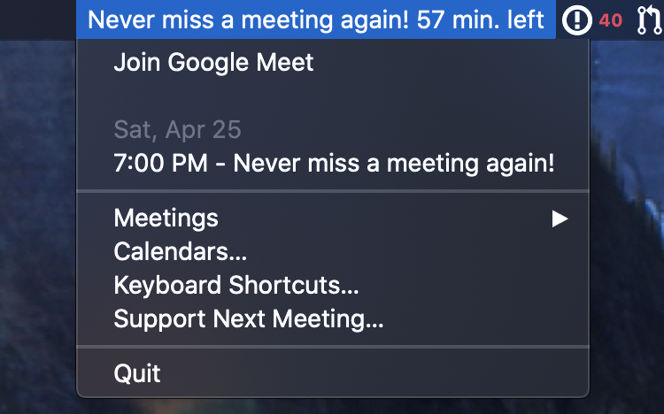
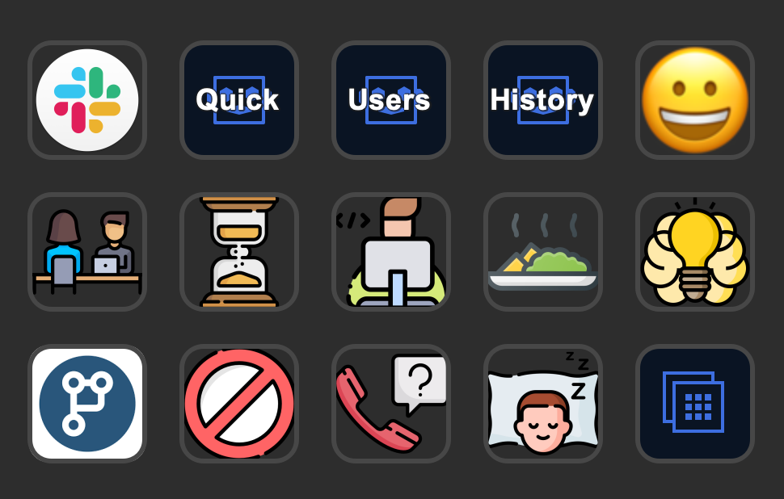
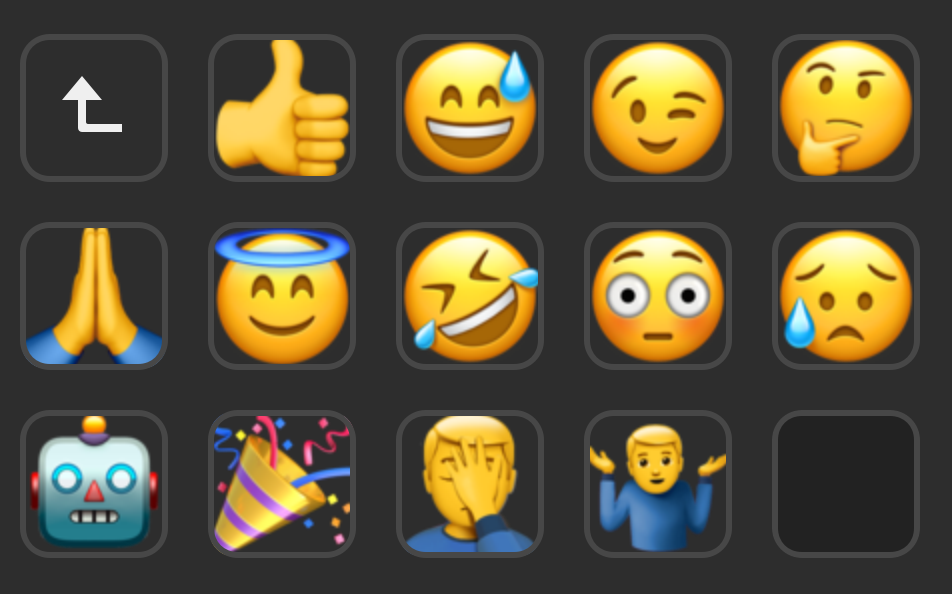

<p align="center">
  <!-- img -->
</p>
<h1 align="center">
  My Mac OS setup and workflow
</h1>
<p align="center">
  My Mac OS setup, applications and workflows I use as a Web Developer
</p>

## Table of content

<!-- START doctoc generated TOC please keep comment here to allow auto update -->
<!-- DON'T EDIT THIS SECTION, INSTEAD RE-RUN doctoc TO UPDATE -->


- [Disclaimer](#disclaimer)
  - [Good to know!](#good-to-know)
  - [Where to find the right tool?](#where-to-find-the-right-tool)
- [My Hardware](#my-hardware)
- [Setup shell](#setup-shell)
- [Command Line Apps](#command-line-apps)
  - [Quick Look plugins](#quick-look-plugins)
- [Applications](#applications)
  - [Bare minimum](#bare-minimum)
  - [Browsers](#browsers)
  - [Utilities](#utilities)
  - [Automation](#automation)
  - [Tasks & time management](#tasks--time-management)
  - [Storage & backup management](#storage--backup-management)
  - [Code](#code)
  - [Reading & Writing](#reading--writing)
  - [Communication](#communication)
  - [Social Media](#social-media)
  - [Design & Web Design](#design--web-design)
  - [Audio & Video production](#audio--video-production)
  - [Miscellaneous](#miscellaneous)
- [Dock](#dock)
- [Web Applications](#web-applications)
- [Inspiration](#inspiration)
- [Licence](#licence)

<!-- END doctoc generated TOC please keep comment here to allow auto update -->

## Disclaimer
I have been always passionate about tools. Maybe because my father was a carpenter... I always loved experimenting until I can find the right tool for the right task. Being a Front-End Developer requires to know the tools that exist and choosing the one that will perform the task faster and better.

Based on hours of research and testing, I'm sharing all the applications I believe suits the best my work and workflow. It's a living MacOS configuration that, I hope, will also save you time for you to enjoy life more!

### Good to know!

- I tried to keep the right order you should also follow to install packages and applications on your Mac.
- Some tools are free and some are not. I'm lucky to have the ability to pay for licences and subscriptions. But if you are not in that situation, 1) I will try to always share free alternatives, 2) you don't need a paid tool to do an amazing work. Just choose the best tool that suits you and your situation.

### Where to find the right tool?
- [Product Hunt](https://www.producthunt.com/) - By far the best and well-know website where you can find almost everything you need.
- [AlternativeTo](https://alternativeto.net/) - I regulary use AlternativeTo but find it limited and not always accurate. The "ups" are most of the time not relevant or doesn't reflect what people prefer the most. It's a great place to start if you are looking for a list of alternatives though.
- [Slant](https://www.slant.co/) and [stackshare](https://stackshare.io/) - Slant and Stackshare are kind of similar but Stackshare is more developer tools focused. It's a nice source of information to compare apps / webapps.

## My Hardware

Personal Computer: 13" Late 2017 Macbook Pro with Touch bar.
Professional Computer: 15" 2019 Macbook Pro with Touch bar.

Personal Monitor: [LG 34UM69G-B 34" 21:9 UltraWide](https://www.amazon.ca/gp/product/B06XFXX5JH/ref=ppx_yo_dt_b_search_asin_title?ie=UTF8&psc=1)

Personal Keyboards:

* At Work: [Pock3R](https://mechanicalkeyboards.com/shop/index.php?l=product_detail&p=3631) black with blue leds
* At Home: [Ducky One 2 RGB TKL](https://mechanicalkeyboards.com/shop/index.php?l=product_detail&p=4284)

Mouses:

* 2 [Logitech MX Master 2S](https://www.amazon.ca/dp/B071YZJ1G1/ref=cm_sw_em_r_mt_dp_U_92mNEbX6PD4H0)
* 1 [Logitech MX Ergo](https://www.amazon.ca/Logitech%C2%AE-Advanced-Wireless-Trackball-910-005177/dp/B0753P1GTS)

Accessories:

* [Bose]()
* [Elgato Stream Deck](https://www.amazon.ca/dp/B06XKNZT1P/ref=cm_sw_em_r_mt_dp_U_64mNEbDTVAA81)
* [Elgato Green Screen](https://www.amazon.ca/dp/B0743Z892W/ref=cm_sw_em_r_mt_dp_U_n-mNEbNJ37DDK)
* [Focusrite Scarlett-2i2 Gen2](https://www.amazon.ca/dp/B005OZE9SA/ref=cm_sw_em_r_mt_dp_U_v7mNEb9RZNDFG)
* [DBX 286s Microphone Pre-amp Processor](https://www.amazon.ca/dp/B004NDFRVC/ref=cm_sw_em_r_mt_dp_U_V7mNEbTJ0E20E)
* Rode Procaster

## Setup shell

#### [Xcode 11](https://developer.apple.com/xcode/)

- Xcode is required for some applications to run. So having Xcode updated just remove the issue of not being able to install some apps.

```sh
xcode-select --install
```

#### [Homebrew](https://brew.sh) - The Missing Package Manager for macOS

```sh
$ ruby -e "$(curl -fsSL https://raw.githubusercontent.com/Homebrew/install/master/install)"
```

With Homebrew comes `brew-cask` which will allow us to install applications with the command line.

##### Useful commands for Homebrew

```sh
brew update                         # Fetch latest version of homebrew and formula.
brew search {app name}              # Searches all known Casks for a partial or exact match.
brew cask info {app name}           # Displays information about a given Cask
brew cask install {app name}        # Install the given cask.
brew cleanup
```

##### [Cakebrew](https://www.cakebrew.com/) (optional) - A GUI for Cask

```sh
brew cask install cakebrew
```

#### ZSH

```sh
brew install zsh
```

Add this to my `./zshrc`

```sh
export HOMEBREW_CASK_OPTS="--appdir=/Applications"
```

#### [Oh My Zsh](https://ohmyz.sh/#install) - Framework for managing your Zsh configuration

Verify that ZSH is correctly installed

```sh
zsh --version
```

Additionally, Zsh should be set as your default shell.
Run `echo $SHELL` from a new terminal to confirm.
Expected result: `/usr/bin/zsh` or similar

```sh
sh -c "$(curl -fsSL https://raw.githubusercontent.com/robbyrussell/oh-my-zsh/master/tools/install.sh)"
```

Check if Oh My Zsh was correctly installed

## Command Line Apps

#### GNU Coreutils
```sh
brew install coreutils
```


brew tap homebrew/cask-fonts
brew install wget
brew install ffmpeg
brew install youtube-dl
brew install imagemagick

brew install tree


- [Ruby (rbenv)](https://github.com/rbenv/rbenv)

```sh
brew install rbenv ruby-build rbenv-default-gems rbenv-gemset
echo 'eval "$(rbenv init -)"' >> ~/.zshrc
source ~/.zshrc # Apply changes

rbenv install {version}
```

- [node]()
```
brew install node
```

- [nvm](https://github.com/nvm-sh/nvm) - Easily manage your node versions

```sh
wget -qO- https://raw.githubusercontent.com/nvm-sh/nvm/v0.35.3/install.sh | bash
```

Add these lines in the `$HOME/.zshrc` file:

```sh
# place this after nvm initialization!
autoload -U add-zsh-hook
load-nvmrc() {
  local node_version="$(nvm version)"
  local nvmrc_path="$(nvm_find_nvmrc)"

  if [ -n "$nvmrc_path" ]; then
    local nvmrc_node_version=$(nvm version "$(cat "${nvmrc_path}")")

    if [ "$nvmrc_node_version" = "N/A" ]; then
      nvm install
    elif [ "$nvmrc_node_version" != "$node_version" ]; then
      nvm use
    fi
  elif [ "$node_version" != "$(nvm version default)" ]; then
    echo "Reverting to nvm default version"
    nvm use default
  fi
}
add-zsh-hook chpwd load-nvmrc
load-nvmrc
```

To default a specific node version: `nvm alias default {version}`


- [yarn](https://github.com/yarnpkg/yarn) - Fast, reliable, and secure dependency management.

```sh
brew install yarn
```


#### MAS - Install App Store apps from the command line
```sh
brew install mas

mas search {app name} # To search for an app
```

#### Act - Run Github Actions Locally
```sh
brew install nektos/tap/act
```

#### Github CLI
```sh
brew install github/gh/gh
```

### [Quick Look plugins](https://github.com/sindresorhus/quick-look-plugins)

```sh
brew cask install \
    qlcolorcode \
    qlstephen \
    qlmarkdown \
    quicklook-json \
    qlimagesize \
    suspicious-package \
    quicklookase \
    qlvideo
```

## Applications

This is a complete list of all the applications I have on my personal and professional Mac (some apps are only on my personal computer).

### Bare minimum

This is the list of the most essentials apps I would install if I was limited in the number of apps to have.


#### [Little Snitch](https://www.obdev.at/products/littlesnitch/index.html) - Control incoming/outgoing network traffic
![Licence ~$30][licence-30] ![Usage high][usage-high]

##### CLI installation
```sh
brew cask install little-snitch
```


#### [1Password](https://1password.com) - Password manager
![Yearly subscription][subscription-yearly] ![Proprietary backup][backup-proprietary] ![High usage][usage-high]

- Generate all of my passwords with it and keep everything in a secured and encrypted vault kept secure by my one master password.
- No longer need to remember passwords and I now have a unique password for every website [activating two factor authentication](https://support.1password.com/one-time-passwords/) wherever possible.
- All my applications licences are saved in 1Password
- I was previously using [LastPass](https://www.lastpass.com/) until I switched to 1Password in 2019.

##### Extensions / plugins
* [Chrome extension](https://chrome.google.com/webstore/detail/1password-x-%E2%80%93-password-ma/aeblfdkhhhdcdjpifhhbdiojplfjncoa?hl=en) - Update settings and set the shortcut to `⌃⇧P`
* [Setting 1Password 1Click Bookmarks in Alfred](https://www.alfredapp.com/help/features/1password/)


##### CLI installation
```sh
brew cask install 1password

mas install 1333542190
```


#### [Alfred 4](https://www.alfredapp.com) - Launcher, the best alternative for Spolight
![Free][licence-free-limit] ![Licence ~$30][licence-30] ![Backup Dropbox][backup-dropbox] ![High usage][usage-high]

- **Text expansions**: previously using [TextExpander](https://textexpander.com/), I switched in using the snippet feature in Alfred. (text-expander to aflred)

- **Workflows** used (files saved on Dropbox):
    - [caniuse](https://github.com/willfarrell/alfred-caniuse-workflow)
    - [DEVONThink Search](https://www.packal.org/workflow/devonthink-search)
    - F.lux
    - Lorem Ipsum
    - MDN Search
    - [Snippets Lab](http://www.packal.org/workflow/search-snippetslab)
    - Spotify Mini Player
    - Things
    - Alfred Maestro
    - Terminal Finder
    - Copy URL

##### CLI installation
```sh
brew cask install alfred
```


#### [iTerm2](https://www.iterm2.com/downloads.html) - Better than the native terminal
![Free][licence-free] [![Show your support][support]](https://www.iterm2.com/donate.html)

##### CLI installation
```sh
brew cask install iterm2
```


#### [Spotify](https://www.spotify.com/) - Music for my hears
![Montly subscription][subscription-montly] ![Usage high][usage-high]

##### Extensions / plugins
* [Alfred extension]()

##### CLI installation
```sh
brew cask install spotify
```

### Browsers
![Free][licence-free]


#### [Google Chrome](https://www.google.com/chrome/)

Multiple profiles
- Professional user
- Personnal user
- Accessibility user

##### CLI installation
```sh
brew cask install google-chrome
```

##### Chrome extensions
* [Feedly Mini](https://chrome.google.com/webstore/detail/feedly-mini/ndhinffkekpekljifjkkkkkhopnjodja?hl=en) - Easily save the RSS feed of the current website
* [Adblock Plus](https://chrome.google.com/webstore/detail/adblock-plus-free-ad-bloc/cfhdojbkjhnklbpkdaibdccddilifddb?hl=en) - Because I prefer to limit ads
* [1Password](https://chrome.google.com/webstore/detail/1password-x-%E2%80%93-password-ma/aeblfdkhhhdcdjpifhhbdiojplfjncoa?hl=en) - 1Password companion
* [Toolbar Spacer 1](https://chrome.google.com/webstore/detail/toolbar-spacer/golladjmjodbefcoombodcdhimkmgemd?hl=en) - I prefer to separate my extensions visually
* [Clip to DEVONthink](https://chrome.google.com/webstore/detail/clip-to-devonthink/pjoafdokmbmkpolhcnmnkgaicbajigcc?hl=en)
* Save to Notion
* Add to Things 3
* Eagle
* What Runs
* React Developer Tools
* Grammarly

#### [Google Chrome Canary](https://www.google.com/chrome/canary/)

##### CLI installation
```sh
brew cask install google-chrome-canary
```

#### [Firefox](https://www.mozilla.org/en-CA/firefox/new/)

##### CLI installation
```sh
brew cask install firefox
```

#### [Firefox Nightly](https://www.mozilla.org/en-US/firefox/channel/desktop/)

##### CLI installation
```sh
brew cask install firefox-nightly
```

#### [Microsoft Edge](https://www.microsoft.com/en-us/edge) - The browser from Microsoft

##### CLI installation
```sh
brew cask install microsoft-edge
```

### Utilities

#### [Bartender 3](https://www.macbartender.com/) - Organize menu bar icons
![Licence ~$20][licence-20] ![High usage][usage-high]

##### Screenshots

- Pro
    - Show view

    - Hide view

- Person
    - **Show view**

    
(Trailer, Mouseless, SnippetsLabs, PopClip, Magnet, Timing)

    - **Hide view**

    
(Flux, Hammerspoon, Dropbox, Google Backup, Airplay, Wifi)

##### CLI installation
```sh
brew cask install bartender
```

#### [Flux](https://justgetflux.com/) -  Reduce eyes fatigue
![Free][licence-free] ![Usage high][usage-high] [![Show your support][support]](https://justgetflux.com/promo/paypal2.html)


##### CLI installation
```sh
brew cask install flux
```

#### [PopClip](https://pilotmoon.com/popclip/) - Giving more power to my mouse
![Licence ~$10][licence-10] ![Usage high][usage-high]

- List of the [extensions I use](https://pilotmoon.com/popclip/extensions/) (files saved on Dropbox)
    - [Past and Match Style](https://pilotmoon.com/popclip/extensions/ext/PasteAndMatch.popclipextz)
    - [Alfred](https://pilotmoon.com/popclip/extensions/ext/Alfred.popclipextz)
    - [Things 3](https://pilotmoon.com/popclip/extensions/ext/Things3.popclipextz)
    - [DEVONthink 3](https://pilotmoon.com/popclip/extensions/ext/DEVONthink3.popclipextz)
    - [Highlight](https://pilotmoon.com/popclip/extensions/ext/Highlight.popclipextz)
    - [SnippetLab](https://pilotmoon.com/popclip/extensions/ext/SnippetsLab.popclipextz)
    - [Slack](https://pilotmoon.com/popclip/extensions/ext/Slack.popclipextz)
    - [Bitly](https://pilotmoon.com/popclip/extensions/ext/Bitly.popclipextz)
    - [Terminal](https://pilotmoon.com/popclip/extensions/ext/RunCommand.popclipextz)
    - [Fantastical 3](https://pilotmoon.com/popclip/extensions/ext/Fantastical3.popclipextz)

##### CLI installation
```sh
brew cask install popclip
```

#### [Contexts](https://contexts.co) - Window switcher
![Licence ~$10][licence-10] ![Usage high][usage-high]

- Shortcut used:
    ctrl + space

##### CLI installation
```sh
brew cask install contexts
```

#### [Kap](https://getkap.co/) - An open-source screen recorder
![Free][licence-free] ![Usage high][usage-high]

- Plugins activated:
    - [Kap Dropbox](https://github.com/karaggeorge/kap-dropbox)

##### CLI installation
```sh
brew cask install kap
```

#### [Next Meeting](https://apps.apple.com/us/app/next-meeting-quickly-see-your/id1017470484) - Never miss a meeting again
![Free][licence-free] ![Usage high][usage-high]



#### [Moon](https://manytricks.com/moom/) - Move and zoom windows
![Licence ~$10][licence-10] ![Usage high][usage-high]

#### [CleanMyMac X](https://macpaw.com/cleanmymac) - To maintain my Mac as he was new
![Licence ~$50][licence-50] ![Usage high][usage-high]


##### CLI installation
```sh
brew cask install cleanmymac
```

#### [Muzzle](http://muzzleapp.com) - Silence embarrassing notifications
![Free][licence-free] ![Usage high][usage-high]

#### [Lungo](https://sindresorhus.com/lungo) - Prevent your Mac from going to sleep
![Free][licence-free] ![Usage low][usage-low] [![Show your support][support]](https://sindresorhus.com/donate)

#### [Stream Deck](https://www.elgato.com/en/gaming/downloads) -
![Free][licence-free] ![Usage medium][usage-medium] ![Backup iCloud][backup-icloud]

##### VSCode profile

##### Slack profile



| Slack app            | Quick search                            | Access list of users | History - go back          | Emojis folder         |
|:---------------------|:----------------------------------------|:---------------------|:---------------------------|:----------------------|
| Status: In a meeting | Status: Be right back                   | Status: Coding       | Status: Lunch              | Status: Brainstorming |
| Status: PR reviewing | Status: Intensive work - Do not disturb | Status: In a call    | Status: Sleeping / resting | Next profile          |

##### Emojis folder



##### CLI installation
```sh
brew cask install elgato-stream-deck
```

#### [Noizio](https://noiz.io/) - I love birds
![Free][licence-free] ![Usage low][usage-low]

* I use to play different ambients when coding or working in general.
* I also use [Portal](https://portal.app/) and [Thunderspace](https://apps.apple.com/us/app/thunderspace-rain-sleep-sounds/id636485814) on my iPhone.


##### CLI installation
```sh
brew cask install noizio

mas install 928871589
```

#### [Mouseless](https://mouseless.app/) - Practice and learn new keyboard's shortcuts
![Licence ~$20][licence-20] ![Usage low][usage-low]


#### [TeamViewer](https://www.teamviewer.com/en/) - Remote control
![Free][licence-free] ![Usage low][usage-low]

I only use TeamViewer when I need to debug my Mom's computer (which is located in France).

#### [Cardhop](https://flexibits.com/cardhop) - Contacts lists management
![Licence ~$30][licence-30] ![Usage low][usage-low]

- I use Cardhop occasionally to ensure my contact list is up to date or to easily add missing information or missing birthday dates.
- I synchronise my list of Contacts on iCloud and [Gmail Contacts](https://contacts.google.com/) to avoid duplicates.

### Automation

#### [Keyboard Maestro](https://www.keyboardmaestro.com/main/) - The most powerful option to automate EVERYTHING on Mac
![Usage high][usage-high] ![Backup Dropbox][backup-dropbox]

##### CLI installation
```sh
brew cask install keyboard-maestro
```

#### [Hazel](https://www.noodlesoft.com/) - Automate repetitive tasks in a few clicks
![Licence ~$30][licence-30] ![Usage high][usage-high]

##### CLI installation
```sh
brew cask install hazel
```

#### [Karabiner](https://karabiner-elements.pqrs.org/) - Remapping my  keyboards
![Free][licence-free] ![Usage medium][usage-medium] [![Show your support][support]](https://karabiner-elements.pqrs.org/docs/pricing/#supporting-this-project)

#### [BetterTouch Tool](https://folivora.ai/) - Customize multiple devices on the Mac
![Licence ~$30][licence-30] ![Usage medium][usage-medium]

##### CLI installation
```sh
brew cask install bettertouchtool
```

#### [Hammerspoon](https://www.hammerspoon.org/) - OSX automation using Lua
![Free][licence-free]

##### CLI installation
```sh
brew cask install hammerspoon
```

### Tasks & time management

#### [Fantastical](https://flexibits.com/fantastical) - Calendar
![Free][licence-free] ![High usage][usage-high]

- I use the app to manage personal and professional events.
- I always view my events from `Week` view. And show 5 days with 16h shown for all days. This lets me have a perspective over what I have to do now. What deadlines I have to complete soon. And gives me the freedom to adjust my schedule in light of upcoming deadlines and events.

##### CLI installation
```sh
brew cask install fantastical
```

#### [Things](https://culturedcode.com/things/) - Task manager
![Licence ~$30][licence-30] ![Proprietary backup][backup-proprietary] ![High usage][usage-high]

- I used [Todoist](https://todoist.com/) for few years but decided to try Things.

##### CLI installation
```sh
brew cask install things

mas install 904280696
```

#### [Timing](https://timingapp.com/?lang=en) - To record everything I do without manual action
![Yearly subscription][subscription-yearly] ![High usage][usage-high]


##### CLI installation
```sh
brew cask install timing
```

### Storage & backup management

#### [Dropbox](https://www.dropbox.com/individual) - Online Cloud Backup
![Monthly subscription][subscription-montly] ![Usage high][usage-high]

##### To DO after install
- [ ] Select `Apps` and `Screenshots` folders to sync

##### CLI installation
```sh
brew cask install dropbox
```

#### [Google Backup Up & Sync](https://www.google.com/drive/download/backup-and-sync/)
![Free][licence-free] ![Usage high][usage-high]

##### To DO after install
- [ ] Choose folders to sync

#### [ForkLift](https://binarynights.com/) - Dual pane file manager and file transfer client for macOS
![Licence ~$30][licence-30] ![Usage medium][usage-medium]

##### To DO after install
- [ ] *Sync favorites* with Dropbox


##### CLI installation
```sh
brew cask install forklift

mas install 412448059
```

#### [The Unarchiver](https://theunarchiver.com/) - The missing RAR and Zip unarchiver
![Free][licence-free] ![Usage high][usage-high]

##### CLI installation
```sh
brew cask install the-unarchiver

mas install 425424353
```

#### [Hard Disk Manager](https://www.paragon-software.com/hdm-mac/) - Maintain and manage my external hard drives
![Licence ~$65][licence-50] ![Usage low][usage-low]


#### [GoodSync](https://www.goodsync.com/download) - Backup/sync and file organization
![Licence ~$30][licence-30]


### Code
----

#### [Visual Studio Code](https://github.com/Microsoft/vscode) - Code editor
![Free][licence-free] ![Usage high][usage-high]

sync settings

##### CLI installation
```sh
brew cask install visual-studio-code
```

#### [Tower](https://www.git-tower.com/) - Git client
![Yearly subscription][subscription-yearly] ![Usage high][usage-high]

- I love using Tower as it gave me a more visual representation of my Github projects. When I'm not using Tower, I use some aliases enabled in ZSH to speedup Git commands.


##### CLI installation
```sh
brew cask install tower
```

#### [Diffmerge](https://sourcegear.com/diffmerge/downloads.php) - Compare and merge files
![Free][licence-free] ![Usage low][usage-low]

##### CLI installation
```sh
brew cask install diffmerge
```

#### [SnippetsLabs](https://www.renfei.org/snippets-lab/) - Code snippets manager
![Licence ~$10][licence-10] ![Backup iCloud][backup-icloud] ![Usage high][usage-high]


- I store all my code snippets

Other options
- [Alfred](https://www.alfredapp.com/extras/snippets/), [VSCode](https://code.visualstudio.com/docs/editor/userdefinedsnippets)

##### Extensions / plugins
* [Alfred extension](http://www.packal.org/workflow/search-snippetslab)
* [PopClip extension](https://pilotmoon.com/popclip/extensions/page/SnippetsLab)

##### CLI installation
```sh
mas install 1006087419
```

#### [Trailer](http://ptsochantaris.github.io/trailer/) - Github Notifications
![Free][licence-free] ![Usage high][usage-high]

#### [Proxyman](https://proxyman.io/) - Best Web Debugging Proxy for MacOS
![Free][licence-free-limit] ![Usage medium][usage-medium]

I found Proxyman when struggling making Charles working on my Mac. Proxyman make it really easy to....


#### [Paw](https://paw.cloud/) - Beautiful HTTP client for Mac
![Backup Dropbox][backup-dropbox] ![Usage medium][usage-medium]

https://paw.cloud/extensions/

##### CLI installation
```sh
brew cask install paw
```

#### [Postman](https://www.postman.com/downloads/) - A free alternative to Paw
![Free][licence-free] ![Usage medium][usage-medium]

#### [Mockoon](https://mockoon.com/)
![Free][licence-free] ![Usage medium][usage-medium]

##### CLI installation
```sh
brew cask install mockoon
```

#### [Docker](https://www.docker.com/products/docker-desktop) - Containerize everything!
![Free][licence-free] ![Usage high][usage-high]

##### CLI installation
```sh
brew install docker

brew cask install docker-toolbox
```

#### [Altair GraphQL Client]() - Beautiful GraphQL Client
![Free][licence-free] ![Usage low][usage-low] [![Show your support][support]](https://opencollective.com/altair/donate)

##### CLI installation
```sh
brew cask install altair-graphql-client
```

#### [Screaming Frog SEO Spider]() - Website crawler to test SEO issues
![Free][licence-free-limit] ![Usage low][usage-low]

#### [Poedit](https://poedit.net/download) - Translations made easy
![Free][licence-free-limit] ![Usage low][usage-low]

##### CLI installation
```sh
brew cask install poedit
```

#### [SwitchHosts!](https://oldj.github.io/SwitchHosts/) - Hosts management & switching
![Free][licence-free] ![Usage low][usage-low]

##### CLI installation
```sh
brew cask install switchhosts
```

#### [Core Shell](https://coreshell.app/) - Full featured terminal with OpenSSH support
![Free][licence-free-limit]  ![Usage low][usage-low]

#### [VirtualBox](https://www.virtualbox.org/) - In case I need to debug on Windows
![Free][licence-free] ![Usage low][usage-low]

#### [Smart JSON Editor](http://www.smartjsoneditor.com/) - JSON data manipulation for Mac
![Free][licence-free-limit] ![Licence ~$10][licence-10]

Free alternative [Jayson](https://jayson.app/)

##### CLI installation
```sh
mas install 1268962404
```

#### [Carbonize](https://www.dangercove.com/carbonize/) - Generate beautiful code snippets
![Free][licence-free] ![Usage low][usage-low]


#### [CodeKit](https://codekitapp.com/) - Gulp, Grunt, Pug are on a boat
![Licence ~$34][licence-30] ![Usage low][usage-low]

- CodeKit was one of the best and first software that would convert Sass to CSS. A lot of improvements were made since then. I use it when I'm lazy and don't want to configure Gulp, [ParcelJS](https://parceljs.org/) or Webpack.

#### [Haskell](http://haskellformac.com/) - Haskell for Mac IDE
![Licence ~$30][licence-30] ![Usage low][usage-low]

##### CLI installation
```sh
mas install Haskell
```

#### [Querious](https://www.araelium.com/querious) - MySQL database management
![Free][licence-free] ![Usage low][usage-low]

### Reading & Writing

#### [Reeder](https://reederapp.com/) - News reader
![Licence ~$13][licence-10] ![Usage high][usage-high]

* I use [Feedly](https://feedly.com/) to store all my RSS feeds and synchronize with Reeder.
* I like to activate the *Bionic Reading* setting, which speed up my reading.
* **DEVONthink 3** and **Things** are activated in the "Actions and Sharing" settings.


##### CLI installation
```sh
mas install 880001334
```

#### [Scapple](https://www.literatureandlatte.com/scapple/overview) - Brain, ideas and connections
![Licence ~$20][licence-20] ![Usage medium][usage-medium]

- When I want to brainstorm without any structure, Scapple is the first tool I use in my workflow.
- It allows me to put all words / ideas I can think of and then start establishing relationships.
- When I have a better vision or want to be more organize, I usually switch in using [MindNode](#mindnode---interactive-mind-mapping).


##### CLI installation
```sh
brew cask install scapple

mas install 568020055
```

#### [MindNode](https://mindnode.com) - Interactive Mind Mapping
![Licence ~$30][licence-30] ![Backup iCloud][backup-icloud] ![High medium][usage-medium]


##### CLI installation
```sh
brew cask install mindnode-pro

mas install 1289197285
```

#### [Notion](https://www.notion.so) - Notes, docs, knowledge base and more, in one place
![Yearly subscription][subscription-yearly] ![Proprietary backup][backup-proprietary] ![High usage][usage-high]

##### CLI installation
```sh
brew cask install notion
```

#### [DEVONthink](https://www.devontechnologies.com/apps/devonthink) - To collect, organize and edit all my documents and articles
 ![Usage high][usage-high] ![Backup iCloud][backup-icloud]

* I used [Evernote](https://evernote.com/) for years, but the lack of new features I decided to use DEVONthink and have no regrets.


##### Extensions / plugins
* [Chrome extension](https://chrome.google.com/webstore/detail/clip-to-devonthink/pjoafdokmbmkpolhcnmnkgaicbajigcc?hl=en)
* [Alfred extension](https://www.packal.org/workflow/devonthink-search)
* [PopClip extension](https://pilotmoon.com/popclip/extensions/page/DEVONthink3)
* [Airmail services activation](https://help.airmailapp.com/en-us/article/integration-devonthink-1wd677j/)

##### CLI installation
```sh
brew cask install devonthink
```

#### [DEVONagent Pro](https://www.devontechnologies.com/apps/devonagent) - Search the web and filter the results
![Licence ~$50][licence-50] ![High medium][usage-medium]

* I use DEVONagent Pro every-time I need to do research to prepare a presentation, write an article or produce some sort of content.


#### [MWeb](https://www.mweb.im/) - A powerful Markdown Editor
![Licence ~$20][licence-20] ![Backup iCloud][backup-icloud] ![Usage high][usage-high]

- I've used [Marked 2](https://marked2app.com/), [Ulysses](https://ulysses.app/) and [Boostnode](https://boostnote.io/) but MWeb is the one app I've enjoy the most using.


##### CLI installation
```sh
mas install 1403919533
```

#### [Scrivener](https://www.literatureandlatte.com/scrivener/overview) - One day I want to be a writer
![Usage low][usage-low]

- Scrivener is the perfect tool to write any book.
- I've used Scrivener in the past to work on the outline for a video course.
- I'm planning in using it more and maybe start writing small non-fictional ebooks soon.


##### CLI installation
```sh
brew cask install scrivener

mas install 1310686187
```

#### [Apple Keynote](https://www.apple.com/keynote/) - A better alternative to Powerpoint
![Free][licence-free]

### Communication

#### [Slack](https://slack.com) - Work chat and more
![Free][licence-free] ![Usage high][usage-high]

##### Workspaces
- HomeX
- Dias testing (my own Slack workspace to test apps and webhooks)
- [Contentful Community](https://www.contentful.com/slack/)
- [A11y](https://web-a11y.slack.com/#/)
- [TorontoJS](http://slack.torontojs.com/)
- [FEDs](http://fedsonslack.com/)
- [Civic Tech Toronto](http://civictechto-slack-invite.herokuapp.com/)

```sh
brew install cask slack

mas install 803453959
```

#### [Airmail](https://airmailapp.com/) - My favorite email client
![Free][licence-free-limit] ![Yearly subscription][subscription-yearly] ![Backup iCloud][backup-icloud] ![Usage high][usage-high]

* I've been using Airmail since I fully work on MacOS.
* I tried [Spark](https://sparkmailapp.com/) for few days but I didn't feel it was a big win in comparaison to Airmail.
* Like many people, I approach my emails tasks in GTD style, trying to always be close to zero emails in my inbox.

##### Filters and triage

I used "filters" on Gmail to organize most of my emails (especially newsletters, bills, recurring emails...). I wish Gmail would have an easiest way to create these filters.


##### CLI installation
```sh
brew cask install airmail

mas install 918858936
```

### Social Media

I have a strict rule in regards to social apps on my professional Mac. I usually don't have any social / communication app that is not directly related to work (only Slack).

#### [Flume](https://flumeapp.com/) - To manage Instagram on Mac
![Free][licence-free] ![Usage low][usage-low]

#### [Messenger](https://apps.apple.com/us/app/messenger/id1480068668?mt=12) - Facebook Messenger but on Mac
![Free][licence-free] ![Usage low][usage-low]

#### [WhatApps](https://www.whatsapp.com/download) - WhatApps on Mac
![Free][licence-free] ![Usage low][usage-low]

#### [Discord](https://discordapp.com/download) -
![Free][licence-free] ![Usage low][usage-low]

#### [Skype](https://www.skype.com/en/get-skype/)
![Free][licence-free] ![Usage low][usage-low]

* Skype was my to-go chat app for years, but since Google Meet, Facebook Messenger and WhatsApp, I only use with 2-3 people that are not on these platforms.

##### CLI installation
```sh
brew cask install skype
```

#### [Telegram](https://desktop.telegram.org/) -

##### CLI installation

```sh
mas install 747648890
```

### Design & Web Design

I'm not a Web Designer / Designer, but I love studying Photography, UI and UX. I try to practice as much as I can using the following applications.

#### [Eagle](https://en.eagle.cool/) - Organize my design library
![Yearly subscription][subscription-yearly] ![Usage high][usage-high] ![Backup Dropbox][backup-dropbox]

##### Extensions / plugins
* [Eagle Chrome extension](https://chrome.google.com/webstore/detail/eagle-save-images-faster/lieogkinebikhdchceieedcigeafdkid?hl=en)

#### [Rightfont 5](https://rightfontapp.com/) - The best font manager for Mac
![Licence ~$35][licence-30] ![Usage medium][usage-medium] ![Backup Dropbox][backup-dropbox]

- By far, the best font manager that supports my library of more than 80 000 font files.


#### [IconJar](https://geticonjar.com/) - Best icon manager
![Usage low][usage-low] ![Backup Dropbox][backup-dropbox]

* All my icons are stored on IconJar
* I could also used [Eagle](#eagle---organize-my-design-library) to store these, but I prefer to have a dedicated software to manage all icon's formats.


#### [Adobe Creative Cloud](https://www.adobe.com/ca/creativecloud.html)
![Monthly subscription][subscription-montly] ![Proprietary backup][backup-proprietary] ![Usage high][usage-high]

- List of Adobe Softwares I use
    - Adobe Photoshop
    - Adobe Illustrator
    - Adobe Premiere Rush
    - Adobe Premiere Pro
    - Adobe Audition
    - Adobe Lightroom Classic
    - Adobe Acrobat

##### CLI installation
```sh
brew cask install adobe-creative-cloud
```

#### [Figma](https://www.figma.com/)
![Free][licence-free-limit] ![Usage low][usage-low] ![Usage medium][usage-medium]

##### CLI installation
```sh
brew cask install figma
```

#### [Sketch](https://www.sketch.com/)
![Yearly subscription][subscription-yearly] ![Usage medium][usage-medium] ![Backup Dropbox][backup-dropbox]

##### CLI installation
```sh
brew cask install sketch
```

#### [Sketchpacks](https://sketchpacks.com/)
![Free][licence-free]

#### Zeplin

#### [Sip](https://sipapp.io/) - Collect, organize and share colors
![Yearly subscription][subscription-yearly] ![Usage medium][usage-medium] ![Proprietary backup][backup-proprietary]

##### CLI installation
```sh
brew cask install sip
```

#### [ImageOptim](https://imageoptim.com/mac) - Optimize images
![Free][licence-free] ![Usage low][usage-low]

##### CLI installation
```sh
brew cask install imageoptim
```

### Audio & Video production

#### [VLC](https://www.videolan.org/vlc/index.html) - A Media player built by my compatriots
![Free][licence-free] ![Usage high][usage-high] [![Show your support][support]](https://www.videolan.org/contribute.html#money)

#### [Loopback](https://rogueamoeba.com/loopback/) -
 ![Usage low][usage-low]

#### [Audio Hijack](https://rogueamoeba.com/audiohijack/) - Record any audio
 ![Usage low][usage-low]

#### [Ecamm Live](https://www.ecamm.com/mac/ecammlive/) -
 ![Usage high][usage-high]

#### [Streamlabs OBS](https://streamlabs.com/) - The best (and free)  streaming app
![Free][licence-free] ![Usage medium][usage-medium]

#### [Screenflow 8](https://www.telestream.net/controls/screenflow/download-screenflow.htm) - Screen recording and editing like a pro
![Licence ~$100][licence-100] ![Usage low][usage-low] ![Backup Dropbox][backup-dropbox]

- Screenflow doesn't recommend to store files on Dropbox, so I usually store the files on Dropbox but move them to my local hard drive if I want to edit these. No problem until today.

#### [Power Prompter](https://suborbital.io/powerprompter/download/) -
![Licence ~$50][licence-50] ![Usage low][usage-low]

#### [Twitch](https://www.twitch.tv/) - The well-known streaming platform
![Free][licence-free] ![Usage medium][usage-medium]

#### [Airy](https://www.airy-youtube-downloader.com/) - YouTube video and MP3 Downloader
![Licence ~$10][licence-10] ![Usage low][usage-low]

##### CLI installation
```sh
brew cask install airy
```

### Miscellaneous

#### [KeyKey](http://keykey.ninja/) - A minimalist touch typing tutor for Mac
![Licence ~$20][licence-20] ![Usage low][usage-low]

#### [Type Fu](https://type-fu.com/) - Typing training
![Free][licence-free]

#### [Typesy](https://www.typesy.com/) - When I want to compete with my wife
![Licence ~$30][licence-30] ![Usage low][usage-low]

#### [GPG Suite](https://gpgtools.org/) - Encrypt, decrypt, sign and verify files or messages.
![Free][licence-free]

- I use this also for signing my commits.

#### [Hue Sync](https://www2.meethue.com/en-au/entertainment/hue-sync) - Sync my lights with audio / video files
![Free][licence-free] ![Usage low][usage-low]

#### [balenaEtcher]() - RaspberryPi microSim flasher
![Free][licence-free] ![Usage low][usage-low]

##### CLI installation

```sh
brew cask install bartender
```

## Dock

Add spaces to my dock

```sh
defaults write com.apple.dock persistent-apps -array-add '{"tile-type"="spacer-tile";}'; killall Dock
```

- Dock screenshot


## Web Applications

https://themer.dev/

## Inspiration

Heavily inspired by the works from:

- https://github.com/nikitavoloboev/my-mac-os
- https://github.com/donnemartin/dev-setup

## Licence

MIT

[licence-free]: https://img.shields.io/static/v1?style=flat-square&label=LICENCE&message=FREE&color=green
[licence-free-limit]: https://img.shields.io/static/v1?style=flat-square&label=LICENCE&message=FREE%20with%20limits&color=green
[licence-10]: https://img.shields.io/static/v1?style=flat-square&label=LICENCE&message=~$10&color=orange
[licence-20]: https://img.shields.io/static/v1?style=flat-square&label=LICENCE&message=~$20&color=orange
[licence-30]: https://img.shields.io/static/v1?style=flat-square&label=LICENCE&message=~$30&color=orange
[licence-50]: https://img.shields.io/static/v1?style=flat-square&label=LICENCE&message=~$50&color=orange
[licence-100]: https://img.shields.io/static/v1?style=flat-square&label=LICENCE&message=~$100&color=orange

[subscription-montly]: https://img.shields.io/static/v1?style=flat-square&label=SUBSCRIPTION&message=montly&color=red
[subscription-yearly]: https://img.shields.io/static/v1?style=flat-square&label=SUBSCRIPTION&message=yearly&color=red

[backup-icloud]: https://img.shields.io/static/v1?style=flat-square&label=Backup&message=iCloud&color=1abc9c
[backup-dropbox]: https://img.shields.io/static/v1?style=flat-square&label=Backup&message=Dropbox&color=1abc9c
[backup-proprietary]: https://img.shields.io/static/v1?style=flat-square&label=Backup&message=Proprietary&color=1abc9c

[since-2016]: https://img.shields.io/static/v1?style=flat-square&label=Using%20since&message=2016&color=1f425f
[since-2017]: https://img.shields.io/static/v1?style=flat-square&label=Using%20since&message=2017&color=1f425f
[since-2018]: https://img.shields.io/static/v1?style=flat-square&label=Using%20since&message=2018&color=1f425f
[since-2019]: https://img.shields.io/static/v1?style=flat-square&label=Using%20since&message=2019&color=1f425f

[usage-high]: https://img.shields.io/static/v1?style=flat-square&label=Usage&message=high&color=yellow
[usage-medium]: https://img.shields.io/static/v1?style=flat-square&label=Usage&message=medium&color=yellow
[usage-low]: https://img.shields.io/static/v1?style=flat-square&label=Usage&message=low&color=yellow

[support]: https://img.shields.io/static/v1?style=flat-square&label=Support&message=this%20app&color=purple
