<h1 align="center">
  My Mac OS setup and applications
</h1>
<p align="center">
    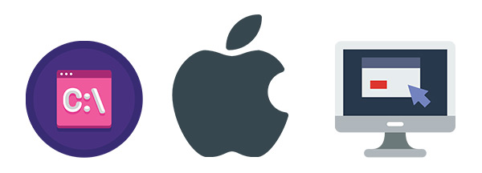
</p>
<p align="center">
  My Mac OS setup and the best applications I use as a Web Developer
</p>

<p align="center">
<a href="https://www.producthunt.com/posts/my-mac-os-setup-and-applications?utm_source=badge-featured&utm_medium=badge&utm_souce=badge-my-mac-os-setup-and-applications" target="_blank"></a>
</p>

## Table of content

<!-- START doctoc generated TOC please keep comment here to allow auto update -->
<!-- DON'T EDIT THIS SECTION, INSTEAD RE-RUN doctoc TO UPDATE -->


- [Disclaimer](#disclaimer)
- [Usage](#usage)
  - [Where to find the right tool?](#where-to-find-the-right-tool)
- [My Hardware](#my-hardware)
- [Setup shell](#setup-shell)
- [Command Line Apps](#command-line-apps)
- [Applications](#applications)
  - [Bare minimum](#bare-minimum)
  - [Browsers](#browsers)
  - [Utilities](#utilities)
  - [Automation](#automation)
  - [Tasks & time management](#tasks--time-management)
  - [Storage & backup management](#storage--backup-management)
  - [Code](#code)
  - [Reading & Writing](#reading--writing)
  - [Communication](#communication)
  - [Social Media](#social-media)
  - [Design & Web Design](#design--web-design)
  - [Audio & Video production](#audio--video-production)
  - [Miscellaneous](#miscellaneous)
- [Mac preferences](#mac-preferences)
  - [Dock](#dock)
- [Web Applications](#web-applications)
- [Inspiration](#inspiration)
- [Icons and images](#icons-and-images)
- [Licence](#licence)

<!-- END doctoc generated TOC please keep comment here to allow auto update -->

## Disclaimer
I have been always passionate about tools. I always loved experimenting until I can find the right tool for the right task. Being a Front-End Developer requires to know the tools that exist and choose the one that will perform the task faster and better.

Based on hours of research and testing, I'm sharing all the applications I believe suits the best my work and daily workflow. It's a living MacOS configuration that, I hope, will also save you time for you to enjoy life more!

## Usage

- I tried to keep the right order you should also follow to install packages and applications on your Mac (particularly the [setup shell](#setup-shell) part)
- Some tools are free and some are not. I'm lucky to have the ability to pay for licences and subscriptions. But if you are not in that situation, 1) You will find free alternatives in the "Alternatives" section of most of the tools, 2) you don't need a paid tool to do an amazing work. Just choose the best tool that suits you and your situation.

### Where to find the right tool?
- [Product Hunt](https://www.producthunt.com/?ref=thedaviddias) - By far the best and well-know website where you can find almost everything you need. You will sometimes find a badge ![Upvote on Product Hunt][product-hunt] that redirects to the Product Hunt page. Show some ❤️ to the makers!
- [AlternativeTo](https://alternativeto.net/?ref=thedaviddias) - I regularly use AlternativeTo but find it limited and not always accurate. The "ups" are most of the time not relevant or doesn't reflect what people prefer the most. It's a great place to start if you are looking for a list of alternatives though.
- [Slant](https://www.slant.co/?ref=thedaviddias) and [stackshare](https://stackshare.io/?ref=thedaviddias) - Slant and Stackshare are kind of similar but Stackshare is more developer tools focused. It's a nice source of information to compare apps / web apps.

## My Hardware

* Personal Computer: 13" Late 2017 Macbook Pro with Touch bar.
* Personal Monitor: [LG 34UM69G-B 34" 21:9 UltraWide](https://www.amazon.ca/gp/product/B06XFXX5JH/ref=ppx_yo_dt_b_search_asin_title?ie=UTF8&psc=1)

Personal Keyboards:

* At Home 1: [Keychron K3](https://www.keychron.com/pages/keychron-k3-wireless-mechanical-keyboard) optical brown switch
* At Home 2: [Ducky One 2 RGB TKL](https://mechanicalkeyboards.com/shop/index.php?l=product_detail&p=4284)

Mouses:

* 2 [Logitech MX Master 2S](https://www.amazon.ca/dp/B071YZJ1G1/ref=cm_sw_em_r_mt_dp_U_92mNEbX6PD4H0)
* 1 [Logitech MX Ergo](https://www.amazon.ca/Logitech%C2%AE-Advanced-Wireless-Trackball-910-005177/dp/B0753P1GTS)

Accessories:

* [Bose QuietComfort 35 II](https://www.amazon.com/dp/B0756CYWWD/ref=cm_sw_em_r_mt_dp_U_XKlQEbZWNE0YW)
* [AirPods Pro](https://www.apple.com/ca/airpods-pro/)
* [Plugable Thunderbolt 3 Dock](https://www.amazon.ca/dp/B075M1XHCK/ref=cm_sw_em_r_mt_dp_U_bhp4EbSFA2MQS)
* [Elgato Stream Deck](https://www.amazon.ca/dp/B06XKNZT1P/ref=cm_sw_em_r_mt_dp_U_64mNEbDTVAA81)
* [Elgato Green Screen](https://www.amazon.ca/dp/B0743Z892W/ref=cm_sw_em_r_mt_dp_U_n-mNEbNJ37DDK)
* [Focusrite Scarlett-2i2 Gen2](https://www.amazon.ca/dp/B005OZE9SA/ref=cm_sw_em_r_mt_dp_U_v7mNEb9RZNDFG)
* [DBX 286s Microphone Pre-amp Processor](https://www.amazon.ca/dp/B004NDFRVC/ref=cm_sw_em_r_mt_dp_U_V7mNEbTJ0E20E)
* [Rode Procaster](https://www.amazon.com/dp/B001IPUJJI/ref=cm_sw_em_r_mt_dp_U_wLlQEbV5FS1XC)
* [NETGEAR 8-Port Gigabit Ethernet Smart Managed Pro Switch (GS308T)](https://www.amazon.ca/dp/B01MYTIPG2/ref=cm_sw_em_r_mt_dp_QQXN7GR51BJ2R9ZWH8QJ?_encoding=UTF8&psc=1)

## Setup shell

#### [Xcode 11](https://developer.apple.com/xcode/)

- Xcode is required for some applications to run. So having Xcode updated just remove the issue of not being able to install some apps.

```sh
xcode-select --install
```

#### [Homebrew](https://brew.sh) - The Missing Package Manager for macOS

```sh
$ ruby -e "$(curl -fsSL https://raw.githubusercontent.com/Homebrew/install/master/install)"
```

With Homebrew comes `brew-cask` which will allow to install applications with the command line.

##### Useful commands for Homebrew

```sh
brew update                         # Fetch latest version of homebrew and formula.
brew search {app name}              # Searches all known Casks for a partial or exact match.
brew install {package name}         # Install a package
brew info --cask {app name}           # Displays information about a given Cask
brew install --cask {app name}        # Install the given cask.
brew cleanup
```

##### [Cakebrew](https://www.cakebrew.com/) (optional) - A GUI for Cask

```sh
brew install --cask cakebrew
```

#### ZSH - An alternative shell to Bash

```sh
brew install zsh
```

Add this to my `~/.zshrc`

```sh
export HOMEBREW_CASK_OPTS="--appdir=/Applications"
```

#### [Oh My Zsh](https://ohmyz.sh/#install) - Framework for managing your Zsh configuration

Verify that ZSH is correctly installed

```sh
zsh --version
```

Additionally, Zsh should be set as the default shell.
Run `echo $SHELL` from a new terminal to confirm.
Expected result: `/usr/bin/zsh` or similar

```sh
sh -c "$(curl -fsSL https://raw.githubusercontent.com/robbyrussell/oh-my-zsh/master/tools/install.sh)"
```

Check if Oh My Zsh was correctly installed.

## Command Line Apps

⚠️ Some of the following packages are not essential but highly recommended. Some applications may depend on the installation of these packages.

#### [GNU Coreutils](https://www.gnu.org/software/coreutils/) - An essential package with basic tools such as ls, rm...

```sh
brew install coreutils
```

#### [Wget](https://www.gnu.org/software/wget/) - To download data from the web and ftp, easier than curl

```sh
brew install wget
```

#### [Tree](http://mama.indstate.edu/users/ice/tree/) - To create beautiful indented listing of files

```sh
brew install tree

tree -L 1 # to output only the root directories and files
```

#### [Nmap](https://nmap.org/) - A powerful command line network discovery utility

```sh
brew install nmap
```

#### [The Silver Searcher](https://github.com/ggreer/the_silver_searcher) - Really fast code searching tool

```sh
brew install the_silver_searcher
```

#### [jq](https://stedolan.github.io/jq/) - Lightweight and flexible command-line JSON processor

```sh
brew install jq
```

#### [Youtube-dl](https://youtube-dl.org/) - A command line alternative to Airy
```sh
brew install youtube-dl

youtube-dl -f best 'link-of-your-own-youtube-video'
```

#### [FFMPEG](https://www.ffmpeg.org/) - To convert videos in multiple formats

```sh
brew install tesseract-lang && brew install homebrew-ffmpeg/ffmpeg/ffmpeg --with-fdk-aac --with-librsvg --with-libsoxr --with-libssh --with-tesseract --with-libvidstab --with-opencore-amr --with-openh264 --with-openjpeg --with-openssl --with-rubberband --with-webp --with-zeromq --with-zimg --with-srt --with-libvmaf --with-libxml2 --with-game-music-emu --with-libbluray --with-libbs2b --with-libcaca --with-libgsm --with-libmodplug --with-openssl@1.1 --with-rtmpdump --with-speex --with-two-lame --with-wavpack --with-xvid
```

More details [here](https://gist.github.com/clayton/6196167)

#### [blueutil](https://github.com/toy/blueutil) - CLI for bluetooth on OSX

```sh
brew install blueutil
```

#### [Speedtest-cli](https://github.com/sivel/speedtest-cli) - The command line version of Speedtest.net

```sh
brew install speedtest-cli
```

#### [Imagemagick](https://imagemagick.org/index.php) - You can do almost everything to edit/convert images and pdfs

```sh
brew install imagemagick
```

#### [DisplayPlacer](https://github.com/jakehilborn/displayplacer) - Programmatically reorganize your screens layout

```sh
brew tap jakehilborn/jakehilborn && brew install displayplacer
```

#### Fonts - Installing some fonts

```sh
brew tap homebrew/cask-fonts

brew install --cask \
    font-fira-code \
    font-source-code-pro font-source-code-pro-for-powerline \
    font-source-sans-pro
```

#### [MAS](https://github.com/mas-cli/mas) - Install App Store apps from the command line

```sh
brew install mas

mas search {app name} # To search for an app
```

#### [Ruby (rbenv)](https://github.com/rbenv/rbenv) - To manage multiple versions of Ruby

```sh
brew install rbenv ruby-build rbenv-default-gems rbenv-gemset
echo 'eval "$(rbenv init -)"' >> ~/.zshrc
source ~/.zshrc # Apply changes
    
rbenv install {version}
```

#### [nvm](https://github.com/nvm-sh/nvm) - Easily manage your node versions

⚠️ (never use brew to install nvm)

```sh
wget -qO- https://raw.githubusercontent.com/nvm-sh/nvm/v0.35.3/install.sh | bash
```

Add these lines in the `$HOME/.zshrc` file:

```sh
export NVM_DIR="$HOME/.nvm"
[ -s "$NVM_DIR/nvm.sh" ] && . "$NVM_DIR/nvm.sh" # This loads nvm
```

And these lines to automatically switch your node version based on the `nvmrc` file.

```sh
# place this after nvm initialization!
autoload -U add-zsh-hook
load-nvmrc() {
  local node_version="$(nvm version)"
  local nvmrc_path="$(nvm_find_nvmrc)"

  if [ -n "$nvmrc_path" ]; then
    local nvmrc_node_version=$(nvm version "$(cat "${nvmrc_path}")")

    if [ "$nvmrc_node_version" = "N/A" ]; then
      nvm install
    elif [ "$nvmrc_node_version" != "$node_version" ]; then
      nvm use
    fi
  elif [ "$node_version" != "$(nvm version default)" ]; then
    echo "Reverting to nvm default version"
    nvm use default
  fi
}
add-zsh-hook chpwd load-nvmrc
load-nvmrc
```

To default a specific node version: `nvm alias default {version}`

#### [yarn](https://github.com/yarnpkg/yarn) - Fast, reliable, and secure dependency management.

```sh
brew install yarn
```

#### [Act](https://github.com/nektos/act) - Run Github Actions Locally

```sh
brew install nektos/tap/act
```

#### [Git standup](https://github.com/kamranahmedse/git-standup) - Recall what you did on the last working day

```sh
brew install git-standup
```

#### [Github CLI](https://cli.github.com/) - Github on the command line

```sh
brew install github/gh/gh
```

#### [Quick Look plugins](https://github.com/sindresorhus/quick-look-plugins)

```sh
brew install --cask \
	qlcolorcode qlmarkdown qlprettypatch qlstephen \
	qlimagesize \
	quicklook-csv quicklook-json epubquicklook 
```

### Node packages to install globally

List all NPM package installed globally: `npm list -g --depth 0`

* [Netlify CLI]() - `npm install netlify-cli -g`
* Gatsby CLI - `npm install -g gatsby-cli`
* NPM-check - `npm install -g npm-check`
* Yarn-check - `npm install -g yarn-check`
* AWS Amplify CLI - `npm install -g @aws-amplify/cli`
* Vercel CLI - `npm i -g vercel`
* Create React App - `npx create-react-app my-app`
* [dotenv-cli](https://www.npmjs.com/package/dotenv-cli) - `npm install -g dotenv-cli`
* Gitmoji - `npm i -g gitmoji-cli`
* Release-it - `npm install --global release-it`
* Plop - `npm i -g plop`


## Applications

This is a complete list of all the applications I have on my personal and professional Mac (some apps are only on my personal computer).

> 🎁 Some applications can be bought individually or you can [subscribe Setapp](https://go.setapp.com/invite/yaychk0m) for a 7-day free trial to test multiple applications and decide the one you want to use!

### Bare minimum

This is the list of the most essentials apps I would install if I was limited in the number of apps to have.


#### [Little Snitch](https://www.obdev.at/products/littlesnitch/index.html) - Control incoming/outgoing network traffic
![Licence ~$30][licence-30] ![Usage high][usage-high] [![Upvote on Product Hunt][product-hunt]](https://www.producthunt.com/posts/little-snitch-4)

<details>
  <summary>What for? - What I ❤️ - What I 👎</summary>

##### What for?

* Little Snitch is perfect to block outgoing or incoming connections.
* When **I'm on the go** and using my mobile data, I usually block some heavy connections so I limit the amount of data spent.

##### What I ❤️

* Easy to use and clean UI

##### What I 👎

* I wish the confirmation window could save "my preferences", so I would not have to select "forever" every time.

</details>

##### CLI installation
```sh
brew install --cask little-snitch
```


#### [1Password](https://1password.com) - Password manager
![Yearly subscription][subscription-yearly] ![High usage][usage-high] ![Proprietary backup][backup-proprietary] [![Upvote on Product Hunt][product-hunt]](https://www.producthunt.com/posts/1password-7-for-mac-and-windows)

<details>
  <summary>What for? - What I ❤️ - What I 👎</summary>

##### What for?

* **Generate all of my passwords** with it and keep everything in a secured and encrypted vault kept secure by my one master password.
* No longer need to remember passwords and I now have a unique password for every website **[activating two factor authentication](https://support.1password.com/one-time-passwords/)** wherever possible.
* All my **applications licences** are saved in 1Password

##### What I ❤️

* 1Password is a native MacOS app and it's probably one of the reason I choose to move away from [LastPass](https://www.lastpass.com/) in 2019.
* Fast
* I can save not just passwords but secure notes, bank accounts, licences...
* Have a shared vault with my wife and being able to send her by Airdrop a new entry.

##### What I 👎

* I loved that LastPass could recognize a form and automatically filled the inputs on a Website. 1Password requires you to 1) Click on the browser extension, 2) Click on "autofill"
* Not sure if it will be one day possible, but unlocking 1Password with the Apple Watch would be awesome.

</details>

##### Extensions / plugins
* [Chrome extension](https://chrome.google.com/webstore/detail/1password-x-%E2%80%93-password-ma/aeblfdkhhhdcdjpifhhbdiojplfjncoa?hl=en) - Update settings and set the shortcut to `⌃⇧P`
* [Setting 1Password 1Click Bookmarks in Alfred](https://www.alfredapp.com/help/features/1password/)

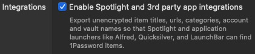

##### CLI installation
```sh
brew install --cask 1password

mas install 1333542190
```


#### [Alfred 4](https://www.alfredapp.com) - Application Launcher, the best alternative for Spolight
![Free][licence-free-limit] ![Licence ~$30][licence-30] ![Backup Dropbox][backup-dropbox] ![High usage][usage-high] [![Upvote on Product Hunt][product-hunt]](https://www.producthunt.com/posts/alfred-3-3)

<details>
  <summary>What for? - What I ❤️ - What I 👎</summary>

##### What for?

* **Open or switch quickly** to any application 
* **Text expansions**: previously using [TextExpander](https://textexpander.com/), I switched in using the snippet feature in Alfred.

##### What I ❤️
    
* Unlimited possibilities to develop any workflows
* Integration with 1Password
* Price
* Tons of options

##### What I 👎
    
* I wish some features like "Snippets", would be more advanced to compete with tools like TextExpander or [Typinator](https://www.ergonis.com/products/typinator/)

</details>

##### List of workflows I use

This is the list of the workflows I used the most (files saved in Dropbox):

- [caniuse](https://github.com/willfarrell/alfred-caniuse-workflow)
- [DEVONThink Search](https://www.packal.org/workflow/devonthink-search) - To search on my DEVONThink databases
- [F.lux](https://www.packal.org/workflow/flux-0) - Change the settings of F.lux
- [Lorem Ipsum](https://www.packal.org/workflow/lorem-ipsum-0) - To generate random Lorem Ipsum text
- [MDN Search](https://www.packal.org/workflow/mdn-search) - One of the best documentation
- [Snippets Lab](http://www.packal.org/workflow/search-snippetslab) - Search code snippets
- [Spotify Mini Player](https://alfred-spotify-mini-player.com/) - Play, Pause, Next, the missing remote for Spotify
- [Things](https://www.packal.org/workflow/things) - Access my tasks from Alfred
- [Alfred Maestro](https://github.com/iansinnott/alfred-maestro) - Search on Keyboard Maestro using Alfred
- [Terminal Finder](https://www.packal.org/workflow/terminalfinder) - Type a command in Alfred and append it directly in the terminal
- [Copy URL](https://www.packal.org/workflow/copy-url) - Copy the current browser tab URL and deliver it in the markdown format

##### CLI installation
```sh
brew install --cask alfred
```

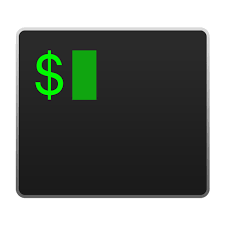

#### [iTerm2](https://www.iterm2.com/downloads.html) - The replacement for  terminal
![Free][licence-free] ![Usage high][usage-high] ![Backup Dropbox][backup-dropbox] [![Show your support][support]](https://www.iterm2.com/donate.html) [![Upvote on Product Hunt][product-hunt]](https://www.producthunt.com/posts/iterm2)

<details>
  <summary>What for? - What I ❤️ - What I 👎</summary>

##### What for?

* Because the native MacOS terminal is ugly and limited in terms of personalization and functionalities.

##### What I ❤️

* The number of options
* The possibility to create multiple profiles
* Password manager

##### What I 👎

* 0️⃣

</details>

##### CLI installation
```sh
brew install --cask iterm2
```

### Browsers
![Free][licence-free]


#### [Google Chrome](https://www.google.com/chrome/)
![Proprietary backup][backup-proprietary]

Multiple profiles
- Professional user
- Personal user
- Accessibility user

##### Chrome extensions
* [Feedly Mini](https://chrome.google.com/webstore/detail/feedly-mini/ndhinffkekpekljifjkkkkkhopnjodja?hl=en) - Easily save the RSS feed of the current website
* [Adblock Plus](https://chrome.google.com/webstore/detail/adblock-plus-free-ad-bloc/cfhdojbkjhnklbpkdaibdccddilifddb?hl=en) - Because I prefer to limit ads
* [1Password](https://chrome.google.com/webstore/detail/1password-x-%E2%80%93-password-ma/aeblfdkhhhdcdjpifhhbdiojplfjncoa?hl=en) - 1Password companion
* [Tabs Mania](https://chrome.google.com/webstore/detail/tabs-mania/kpehljmacelghfpbkoajiigcaijjdogf) - Extension I built to manage tabs
* [Toolbar Spacer 1](https://chrome.google.com/webstore/detail/toolbar-spacer/golladjmjodbefcoombodcdhimkmgemd?hl=en) - I prefer to separate my extensions visually
* [Clip to DEVONthink](https://chrome.google.com/webstore/detail/clip-to-devonthink/pjoafdokmbmkpolhcnmnkgaicbajigcc?hl=en) - Clip the URL, text or screenshot the page and save it in DEVONthink
* [Save to Notion](https://chrome.google.com/webstore/detail/notion-web-clipper/knheggckgoiihginacbkhaalnibhilkk?hl=en) - Save a page, text or anything else to Notion
* [Add to Things 3](https://chrome.google.com/webstore/detail/add-to-things-3/kakcfbhogeepoebcaidchmhphjeknpne?hl=en) - Add the current URL to Things
* [Eagle](https://chrome.google.com/webstore/detail/eagle-save-images-faster/lieogkinebikhdchceieedcigeafdkid?hl=en) - Save images to Eagle (love the drag and drop functionality that works with any image)
* [What Runs](https://chrome.google.com/webstore/detail/whatruns/cmkdbmfndkfgebldhnkbfhlneefdaaip?hl=en) - Discover what runs a website
* [React Developer Tools](https://chrome.google.com/webstore/detail/react-developer-tools/fmkadmapgofadopljbjfkapdkoienihi?hl=en) - The required tool that help to inspect any React component
* [Grammarly](https://chrome.google.com/webstore/detail/grammarly-for-chrome/kbfnbcaeplbcioakkpcpgfkobkghlhen?hl=en) - The life saving tool that help to fix writing errors
* CSS Scan
* [Session Budy](https://chrome.google.com/webstore/detail/session-buddy/edacconmaakjimmfgnblocblbcdcpbko?hl=en) - 
* [Keepa](https://chrome.google.com/webstore/detail/keepa-amazon-price-tracke/neebplgakaahbhdphmkckjjcegoiijjo?hl=en) - Amazon price tracker: know when to buy and when to wait
* [VisBug](https://chrome.google.com/webstore/detail/visbug/cdockenadnadldjbbgcallicgledbeoc?hl=en) - Open source web design debug tool for designers (and developers)
* [JSONView](https://chrome.google.com/webstore/detail/jsonview/chklaanhfefbnpoihckbnefhakgolnmc?hl=en) - To view JSON documents in your browser
* [Momentum](https://chrome.google.com/webstore/detail/momentum/laookkfknpbbblfpciffpaejjkokdgca?hl=en) - The classic and beautiful tab replacement

##### CLI installation
```sh
brew install --cask google-chrome
```


#### [Google Chrome Canary](https://www.google.com/chrome/canary/)

##### CLI installation
```sh
brew install --cask google-chrome-canary
```


#### [Firefox](https://www.mozilla.org/en-CA/firefox/new/)

##### CLI installation
```sh
brew install --caskfirefox
```


#### [Firefox Nightly](https://www.mozilla.org/en-US/firefox/channel/desktop/)

##### CLI installation
```sh
brew install --cask firefox-nightly
```


#### [Microsoft Edge](https://www.microsoft.com/en-us/edge) - The browser from Microsoft

##### CLI installation
```sh
brew install --cask microsoft-edge
```

### Utilities


#### [Bartender 3](https://www.macbartender.com/) - Organize menu bar icons
![Licence ~$20][licence-20] ![High usage][usage-high]

##### Screenshots

- Pro
    - Show view

    - Hide view

- Personal
    - **Show view**

    

    (Trailer, Mouseless, SnippetsLabs, PopClip, Magnet, Timing)

    - **Hide view**

    

    (f.lux, Hammerspoon, Dropbox, Google Backup, Airplay, Wifi)

  
<details>
  <summary>What for? - What I ❤️ - What I 👎</summary>

##### What for?

* Keep your bar icons organize
* Hide some non-essentials icons but make them still available

##### What I ❤️

* Simple to use
* Do the job

##### What I 👎

* 0️⃣

</details>

##### CLI installation
```sh
brew install --cask bartender
```


#### [f.lux](https://justgetflux.com/) -  Reduce eyes fatigue
![Free][licence-free] ![Usage high][usage-high] [![Show your support][support]](https://justgetflux.com/promo/paypal2.html) [![Upvote on Product Hunt][product-hunt]](https://www.producthunt.com/posts/f-lux)

<details>
  <summary>What for? - What I ❤️ - What I 👎</summary>

##### What for?

* Makes it easy for my eyes

##### What I ❤️

* Free
* It works! Can stay longer front of my screen without tiredness or headaches.

##### What I 👎

* 0️⃣

</details>

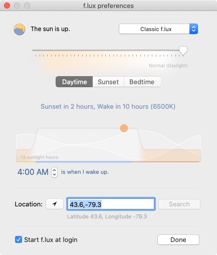

##### CLI installation
```sh
brew install --cask flux
```


#### [PopClip](https://pilotmoon.com/popclip/) - Giving more power to my mouse
![Licence ~$10][licence-10] ![Usage high][usage-high] ![Backup Dropbox for the extensions][backup-dropbox] [![Upvote on Product Hunt][product-hunt]](https://www.producthunt.com/posts/popclip)

<details>
  <summary>What for? - What I ❤️ - What I 👎</summary>

##### What for?

* Gives more power to your mouse and save you few clicks.

##### What I ❤️

* Most of the apps I use in a daily basis have their extension
* I can send any text I highlight in a page to DevonThink or Things

##### What I 👎

* I wish I could disable it on some websites

</details>

- List of the [extensions I use](https://pilotmoon.com/popclip/extensions/) (files saved on Dropbox)
    - [Past and Match Style](https://pilotmoon.com/popclip/extensions/ext/PasteAndMatch.popclipextz)
    - [Alfred](https://pilotmoon.com/popclip/extensions/ext/Alfred.popclipextz)
    - [Things 3](https://pilotmoon.com/popclip/extensions/ext/Things3.popclipextz)
    - [DEVONthink 3](https://pilotmoon.com/popclip/extensions/ext/DEVONthink3.popclipextz)
    - [Highlight](https://pilotmoon.com/popclip/extensions/ext/Highlight.popclipextz)
    - [SnippetLab](https://pilotmoon.com/popclip/extensions/ext/SnippetsLab.popclipextz)
    - [Slack](https://pilotmoon.com/popclip/extensions/ext/Slack.popclipextz)
    - [Bitly](https://pilotmoon.com/popclip/extensions/ext/Bitly.popclipextz)
    - [Terminal](https://pilotmoon.com/popclip/extensions/ext/RunCommand.popclipextz)
    - [Fantastical 3](https://pilotmoon.com/popclip/extensions/ext/Fantastical3.popclipextz)

- Excluded apps

##### CLI installation
```sh
brew install --cask popclip
```


#### [Contexts](https://contexts.co) - Window switcher
![Licence ~$10][licence-10] ![Usage high][usage-high]

- Shortcut used:
    ctrl + space

##### CLI installation
```sh
brew install --cask contexts
```


#### [CleanShot X](https://getcleanshot.com/?ref=thedaviddias) - Capture your Mac’s screen like a pro.
![Licence ~$30][licence-30] ![Usage high][usage-high] ![Backup Dropbox][backup-dropbox] [![Upvote on Product Hunt][product-hunt]](https://www.producthunt.com/posts/cleanshot-x)

<details>
  <summary>What for? - What I ❤️ - What I 👎</summary>

##### What for?

* Doing screenshots and quickly send it to my colleagues 

##### What I ❤️

* All the options you can imagine to have in a screenshot application.
* Can easily rename a file before saving it
* Scrolling capture
* Ability to save as a GIF or a video format
* The Quick Access that keeps the last screenshots as an overlay
* The option to enable "Do Not Disturb" while recording

##### What I 👎

* 0️⃣

</details>

##### CLI installation
```sh
brew install --cask cleanshot
```

#### Alternatives
* Mac (free): [Kap](https://getkap.co/?ref=thedaviddias)
* Windows (paid): [Snagit](https://www.techsmith.com/screen-capture.html)


#### [TextSniper](https://textsniper.app/) - Extract text from images and videos
![Licence ~$10][licence-10] ![Usage low][usage-low] [![Upvote on Product Hunt][product-hunt]](https://www.producthunt.com/posts/textsniper)
 
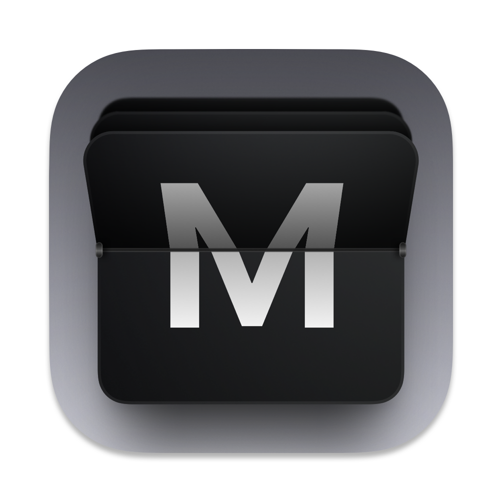

#### [MeetingBar](https://apps.apple.com/us/app/meetingbar/id1532419400) - Never miss a meeting again
![Free][licence-free] ![Usage high][usage-high] [![Upvote on Product Hunt][product-hunt]](https://www.producthunt.com/posts/meetingbar)

<details>
  <summary>What for? - What I ❤️ - What I 👎</summary>

##### What for?

* Show you your next meeting in your icon bar

##### What I ❤️

* Free
* Don't need to open an app or click anywhere to see my next meeting
* Direct access to open Google meet, Zoom and most chat providers

##### What I 👎

* 0️⃣

</details>

---

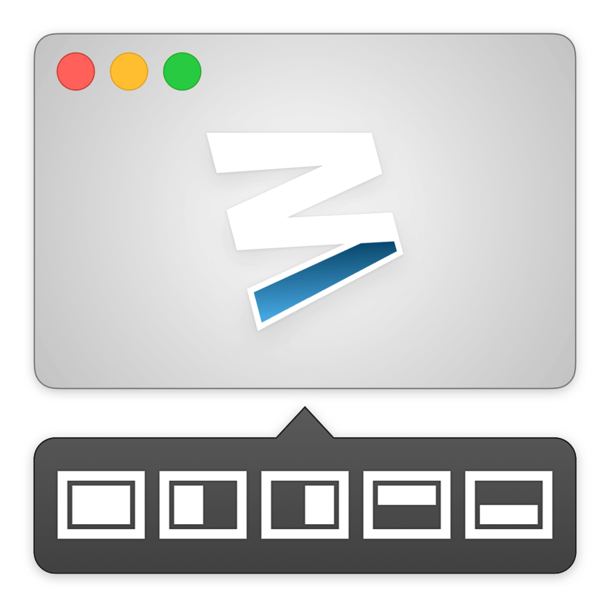

#### [Moom](https://manytricks.com/moom/) - Move and zoom windows
![Licence ~$10][licence-10] ![Usage high][usage-high] [![Upvote on Product Hunt][product-hunt]](https://www.producthunt.com/posts/moom)


#### [CleanMyMac X](https://macpaw.com/cleanmymac) - To maintain my Mac as he was new
![Licence ~$50][licence-50] ![Usage high][usage-high] [![Upvote on Product Hunt][product-hunt]](https://www.producthunt.com/posts/cleanmymac-x)

<details>
  <summary>What for? - What I ❤️ - What I 👎</summary>

##### What for?

* Keep your Mac clean, up-to-date and find any big file (and much more)

##### What I ❤️

* Uninstall properly applications, if you remove an app from the Application folder, it automatically suggest to remove app's dependency files
* Many file management tools in one application
* Space lens
* Give me access to login items
* Easily update apps

##### What I 👎

* 0️⃣

</details>

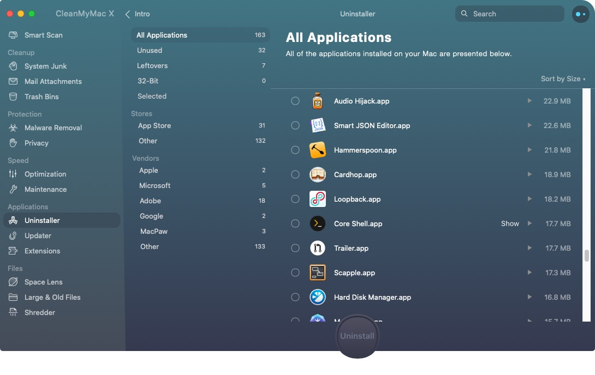

##### CLI installation
```sh
brew install --cask cleanmymac
```


#### [Muzzle](http://muzzleapp.com) - Silence embarrassing notifications
![Free][licence-free] ![Usage high][usage-high] [![Upvote on Product Hunt][product-hunt]](https://www.producthunt.com/posts/muzzle)


#### [Lungo](https://sindresorhus.com/lungo) - Prevent your Mac from going to sleep
![Free][licence-free] ![Usage low][usage-low] [![Show your support][support]](https://sindresorhus.com/donate) [![Upvote on Product Hunt][product-hunt]](https://www.producthunt.com/posts/lungo)


#### [Stream Deck](https://www.elgato.com/en/gaming/downloads) - Defining actions on buttons
![Free][licence-free] ![Usage medium][usage-medium] ![Backup iCloud][backup-icloud] [![Upvote on Product Hunt][product-hunt]](https://www.producthunt.com/posts/elgato-stream-deck)

* I have [few profiles]()

##### CLI installation
```sh
brew install --cask elgato-stream-deck
```


#### [Noizio](https://noiz.io/) - I love birds
![Free][licence-free] ![Usage low][usage-low] [![Upvote on Product Hunt][product-hunt]](https://www.producthunt.com/posts/noizio)

* I use to play different ambients when coding or working in general.
* I also use [Portal](https://portal.app/) and [Thunderspace](https://apps.apple.com/us/app/thunderspace-rain-sleep-sounds/id636485814) on my iPhone.

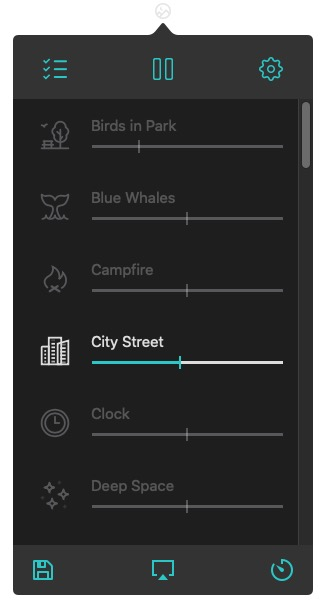

##### CLI installation
```sh
brew install --casknoizio

mas install 928871589
```


#### [Mouseless](https://mouseless.app/) - Practice and learn new keyboard's shortcuts
![Licence ~$20][licence-20] ![Usage low][usage-low] [![Upvote on Product Hunt][product-hunt]](https://www.producthunt.com/posts/mouseless)

<details>
  <summary>What for? - What I ❤️ - What I 👎</summary>

##### What for?

* To learn new shortcuts and use less my mouse

##### What I ❤️

* Automatically suggest shortcuts based on the current app

##### What I 👎

* I wish I could easily add my shortcuts
* Personalize some shortcuts to work with my keyboard

</details>

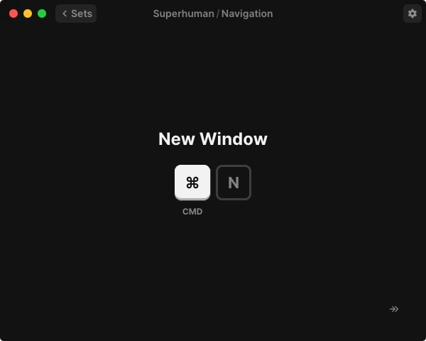

---


#### [TeamViewer](https://www.teamviewer.com/en/) - Remote control
![Free][licence-free] ![Usage low][usage-low]

I only use TeamViewer when I need to debug my Mom's computer (which is located in France).


#### [Cardhop](https://flexibits.com/cardhop) - Contacts lists management
![Licence ~$30][licence-30] ![Backup iCloud][backup-icloud] ![Usage low][usage-low] [![Upvote on Product Hunt][product-hunt]](https://www.producthunt.com/posts/cardhop)

- I use Cardhop occasionally to ensure my contact list is up to date or to easily add missing information or missing birthday dates.
- I synchronise my list of Contacts on iCloud and [Gmail Contacts](https://contacts.google.com/) to avoid duplicates.

### Automation

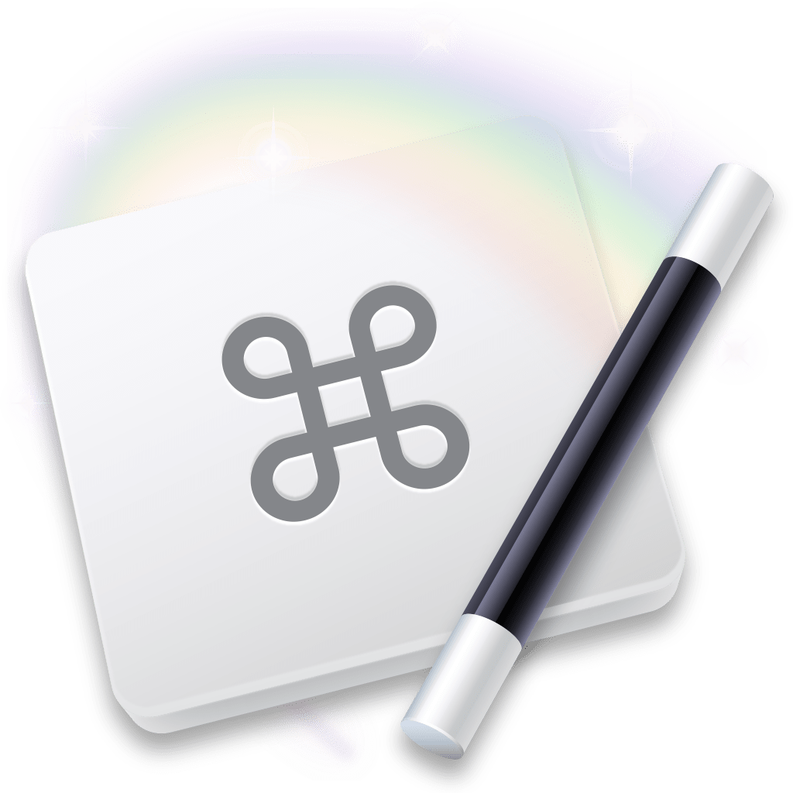

#### [Keyboard Maestro](https://www.keyboardmaestro.com/main/) - The most powerful option to automate EVERYTHING on Mac
![Licence ~$30][licence-30] ![Usage high][usage-high] ![Backup Dropbox][backup-dropbox] ![Backup Dropbox][backup-dropbox] [![Upvote on Product Hunt][product-hunt]](https://www.producthunt.com/posts/keyboard-maestro)

<details>
  <summary>What for? - What I ❤️ - What I 👎</summary>

##### What for?

* Automate your Mac

##### What I ❤️

* Unlimited possibilities and automations
* One of the reason I own Macs since few years

##### What I 👎

* Not enough updates
* You can find examples on Keyboard Maestro forum, but I wish to have more examples and content within the app.

</details>

##### Extensions

* [Alfred Maestro](https://github.com/iansinnott/alfred-maestro) - Search on Keyboard Maestro using Alfred

##### CLI installation
```sh
brew install --cask keyboard-maestro
```


#### [Hazel](https://www.noodlesoft.com/) - Automate repetitive tasks in a few clicks
![Licence ~$30][licence-30] ![Usage high][usage-high] ![Backup Dropbox][backup-dropbox] [![Upvote on Product Hunt][product-hunt]](https://www.producthunt.com/posts/hazel-4-0)

<details>
  <summary>What for? - What I ❤️ - What I 👎</summary>

##### What for?

* Watch folders and create triggers to launch a specified action

##### What I ❤️

* Simpler and faster than Keyboard Maestro to configure
* Hability to import / export rules 

##### What I 👎

* Delay when I cancel a task. Hazel continue running even I disabled one of the rules. Need to "hard cancel" Hazel sometimes.

</details>

##### CLI installation
```sh
brew install --cask hazel
```

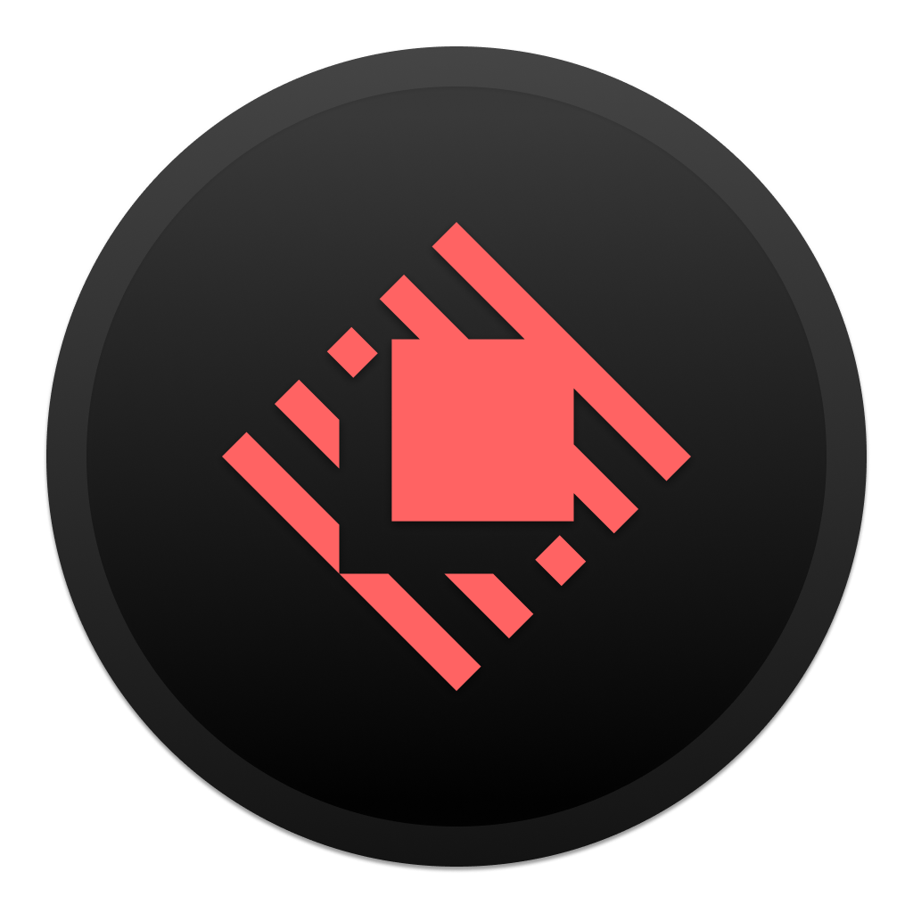

#### [Raycast](https://raycast.com/) - Control tools with few keystrokes
![Free][licence-free] ![Usage medium][usage-medium]


##### CLI installation
```sh
brew install --cask raycast
```


#### [Karabiner](https://karabiner-elements.pqrs.org/) - Remapping my  keyboards
![Free][licence-free] ![Usage medium][usage-medium] ![Backup Github][backup-github] [![Show your support][support]](https://karabiner-elements.pqrs.org/docs/pricing/#supporting-this-project) [![Upvote on Product Hunt][product-hunt]](https://www.producthunt.com/posts/karabiner)


#### [BetterTouch Tool](https://folivora.ai/) - Customize multiple devices on the Mac
![Licence ~$30][licence-30] ![Usage medium][usage-medium] ![Backup Dropbox][backup-dropbox] [![Upvote on Product Hunt][product-hunt]](https://www.producthunt.com/posts/bettertouchtool)

##### CLI installation
```sh
brew install --caskbettertouchtool
```


#### [Hammerspoon](https://www.hammerspoon.org/) - OSX automation using Lua
![Free][licence-free] ![Usage low][usage-low]![Backup Github][backup-github] [![Upvote on Product Hunt][product-hunt]](https://www.producthunt.com/posts/hammerspoon-2)
 
##### CLI installation
```sh
brew install --caskhammerspoon
```

### Tasks & time management

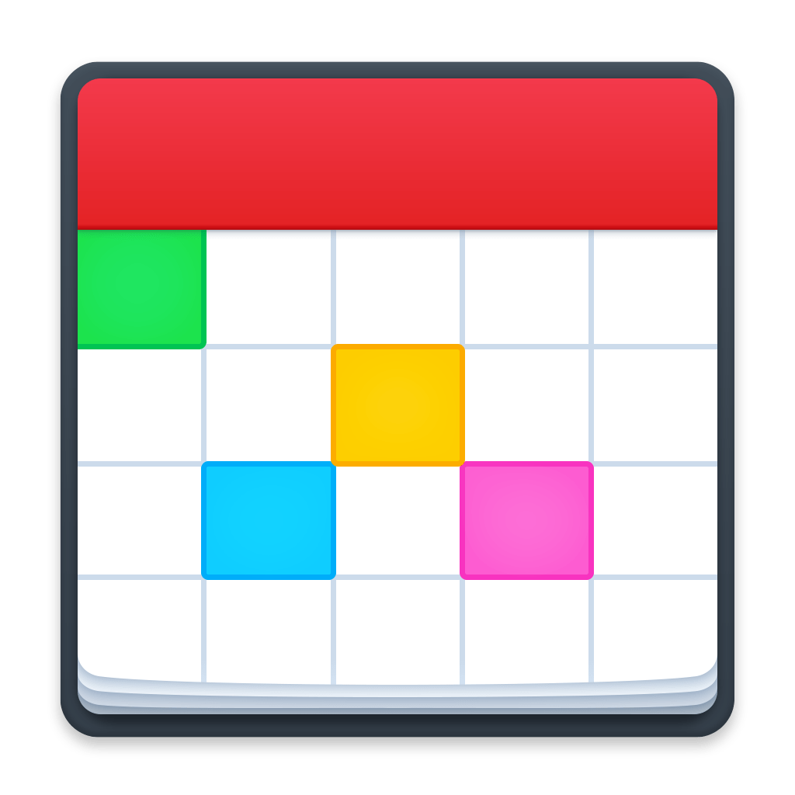

#### [Fantastical](https://flexibits.com/fantastical) - Calendar management
![Free with limits][licence-free-limit] ![High usage][usage-high] [![Upvote on Product Hunt][product-hunt]](https://www.producthunt.com/posts/fantastical-3-0)

- I use Fantastical to manage personal and professional events.
- I always view my events from `Week` view. And shows 5 days with 16h shown for all days. This lets me have a perspective over what I have to do now.

<details>
  <summary>What for? - What I ❤️ - What I 👎</summary>

##### What for?

* An better alternative to the native calendar

##### What I ❤️

* Integration with Reminders and Meetup
* Lightweight
* Easy to use
* Lot of personalization options

##### What I 👎

* I usually understand and don't bother too much with subscriptions, but $52 a year is too much in comparison with other apps I used. Around $35 would make more sense to me. I'm using the free version and it's enough for my needs.
* It's clearly a "trap": when I access the premium details in the preferences, my only option is to click on "Start trial" or Force quit the app... I'm not fan of that.

</details>

##### CLI installation
```sh
brew install --caskfantastical
```


#### [Things](https://culturedcode.com/things/) - Task manager
![Licence ~$30][licence-30] ![High usage][usage-high] ![Proprietary backup][backup-proprietary] [![Upvote on Product Hunt][product-hunt]](https://www.producthunt.com/posts/things-3-0)

- I used [Todoist](https://todoist.com/) for few years but decided to try Things, and even I miss some options from Todoist, I'm loving using Things.

<details>
  <summary>What for? - What I ❤️ - What I 👎</summary>

##### What for?

* Organize my todos and projects

##### What I ❤️

* The UI
* The integration with Shortcuts (iPad OS and iOS)
* Integration with Reminders and a lot of other apps
* Organize by area and projects

##### What I 👎

* Would be awesome to integrate things with other apps through Zapier

</details>

##### CLI installation
```sh
brew install --caskthings

mas install 904280696
```

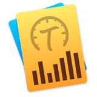

#### [Timing](https://timingapp.com/?lang=en) - To record everything I do without manual action
![Yearly subscription][subscription-yearly] ![High usage][usage-high] [![Upvote on Product Hunt][product-hunt]](https://www.producthunt.com/posts/timing-2-3)

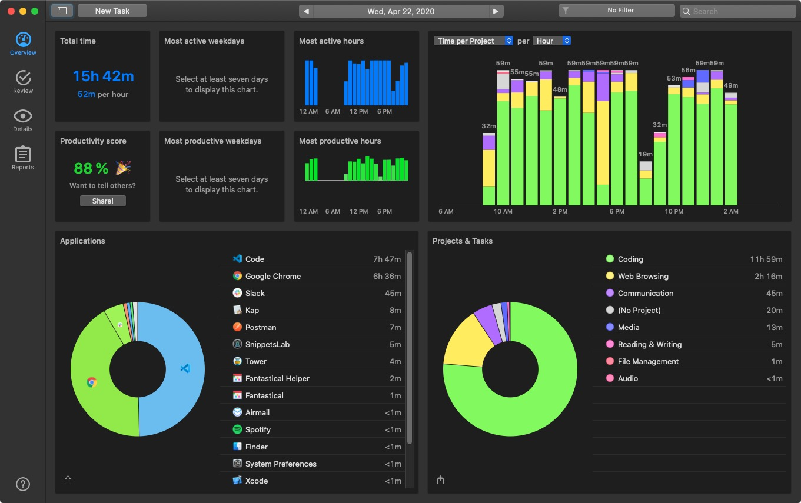

##### CLI installation
```sh
brew install --casktiming
```

### Storage & backup management

I've used Google One many years, but decide to use Dropbox instead. The two main reasons are: integration with most of the apps I used and the offline mode out of the box.


#### [Dropbox](https://db.tt/4dn59Jv3od) - Online Cloud Backup
![Monthly subscription][subscription-montly] ![Usage high][usage-high]

I've used Google Drive storage few years but use now mainly Dropbox because of the integration with a lot of Mac OS, iOs and iPad OS apps.

##### To DO after install
- [ ] Select `Apps` and `Screenshots` folders to sync

<details>
  <summary>What for? - What I ❤️ - What I 👎</summary>

##### What for?

* Backup storage

##### What I ❤️

* Integration with a lot of apps
* Offline / online possibility
* Faster then Google Drive for the synchronization

##### What I 👎

* I wish I could access the "Selective Sync" with fewer clicks

</details>

##### CLI installation
```sh
brew install --caskdropbox
```


#### [Google Backup Up & Sync](https://www.google.com/drive/download/backup-and-sync/)
![Free][licence-free] ![Usage high][usage-high]

##### To DO after install
- [ ] Choose folders to sync


#### [ForkLift](https://binarynights.com/) - Dual pane file manager and file transfer client for macOS
![Licence ~$30][licence-30] ![Backup Dropbox][backup-dropbox] ![Usage medium][usage-medium]

<details>
  <summary>What for? - What I ❤️ - What I 👎</summary>

##### What for?

* Copy-paste with queue and access remote folders

##### What I ❤️

* The copy-paste queue that allow me to pause or resume
* Access remote folders (FTP, Dropbox, S3, Backblaze B2)

##### What I 👎

* Sometime crashes or keep "copying" but is actually blocked.

</details>

##### To DO after install
- [ ] *Sync favorites* with Dropbox

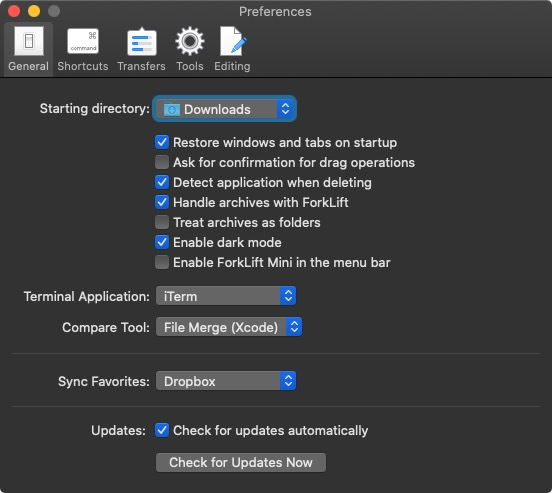

##### CLI installation
```sh
brew install --caskforklift

mas install 412448059
```


#### [The Unarchiver](https://theunarchiver.com/) - The missing RAR and Zip unarchiver
![Free][licence-free] ![Usage high][usage-high] [![Upvote on Product Hunt][product-hunt]](https://www.producthunt.com/posts/the-unarchiver-4-0)


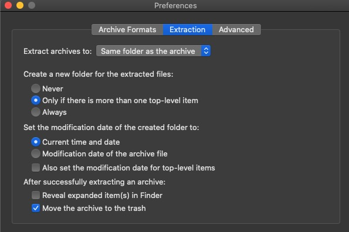

##### CLI installation
```sh
brew install --caskthe-unarchiver

mas install 425424353
```


#### [Hard Disk Manager](https://www.paragon-software.com/hdm-mac/) - Maintain and manage my external hard drives
![Licence ~$65][licence-50] ![Usage low][usage-low]

Sometimes, some external hard drives can gave me tough times. Hard Disk Manager saved me multiple times and it's always good to check the health of your hard drives time to time.


---


#### [GoodSync](https://www.goodsync.com/download) - Backup/sync and file organization
![Licence ~$30][licence-30] 

<details>
  <summary>What for? - What I ❤️ - What I 👎</summary>

##### What for?

* Synchronize files between local and remote storage

##### What I ❤️

* Can sync between various remote storage (ex Drive <> Dropbox)

##### What I 👎

* Crashed some times
* Can take ages depending on how many files and where these are located (not really what I dislike, I just wishes things could be faster 😅)

</details>


#### [Visual Studio Code](https://github.com/Microsoft/vscode) - My preferred code editor
![Free][licence-free] ![Usage high][usage-high] ![Backup Github][backup-github]

The best code editor (for my usage)

##### CLI installation
```sh
brew install --caskvisual-studio-code
```


#### [Tower](https://www.git-tower.com/) - GUI Git client
![Yearly subscription][subscription-yearly] ![Usage high][usage-high] [![Upvote on Product Hunt][product-hunt]](https://www.producthunt.com/posts/tower-3-0)

<details>
  <summary>What for? - What I ❤️ - What I 👎</summary>

##### What for?

* Manage Git projects

##### What I ❤️

* Tower gives me a more visual representation of all my Github repo. When I'm not using Tower, I use some aliases enabled in ZSH to speedup Git commands.

##### What I 👎

* The last versions forced me to sometimes force quit the app, or had to face some crashes. This seems solved by now.

</details>

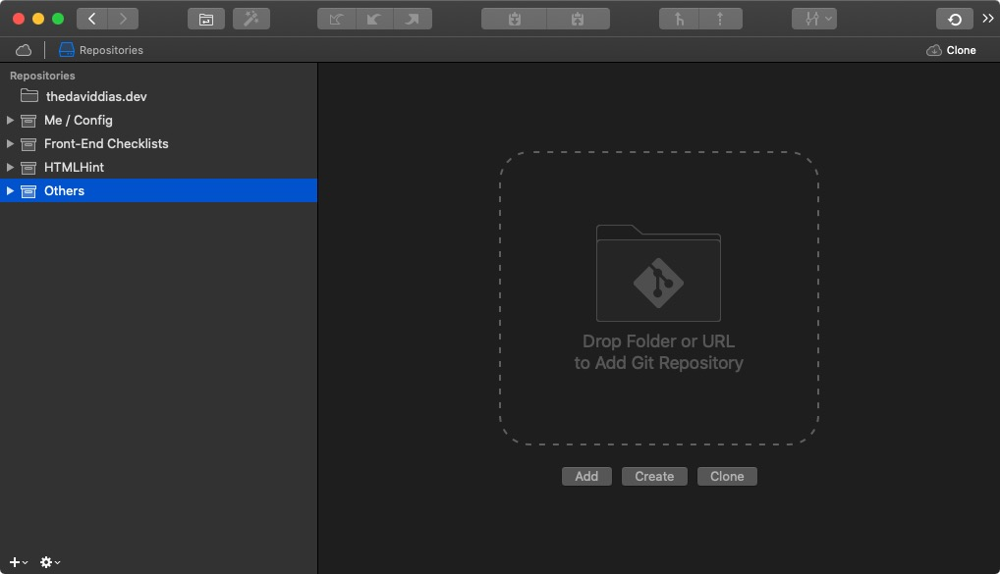

##### CLI installation
```sh
brew install --casktower
```

#### [Diffmerge](https://sourcegear.com/diffmerge/downloads.php) - Compare and merge files
![Free][licence-free] ![Usage low][usage-low]

##### CLI installation
```sh
brew install --caskdiffmerge
```


#### [SnippetsLabs](https://www.renfei.org/snippets-lab/) - Code snippets manager
![Licence ~$10][licence-10] ![Usage high][usage-high] ![Backup iCloud][backup-icloud] ![Backup Github][backup-github]

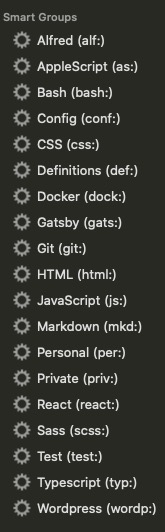

- I store all my code snippets

<details>
  <summary>What for? - What I ❤️ - What I 👎</summary>

##### What for?

* Manage code snippets

##### What I ❤️

* No subscription, price
* Works with Alfred extension and Poplip extension
* Bar icon access
* iCloud synchronization

##### What I 👎

* No recent updates
* Doesn't support syntax highlighting (huge issue for me)

</details>

Other options
- [Alfred](https://www.alfredapp.com/extras/snippets/)
- [VSCode](https://code.visualstudio.com/docs/editor/userdefinedsnippets)

##### Extensions / plugins
* [Alfred extension](http://www.packal.org/workflow/search-snippetslab)
* [PopClip extension](https://pilotmoon.com/popclip/extensions/page/SnippetsLab)

##### Possible alternatives (to be tested)
* [Snipper](https://snipper.app/)

##### CLI installation
```sh
mas install 1006087419
```


#### [Trailer](http://ptsochantaris.github.io/trailer/) - Github Notifications
![Free][licence-free] ![Usage high][usage-high] [![Upvote on Product Hunt][product-hunt]](https://www.producthunt.com/posts/trailer)
 


#### [Proxyman](https://proxyman.io/) - Best Web Debugging Proxy for MacOS
![Free][licence-free-limit] ![Usage medium][usage-medium] [![Upvote on Product Hunt][product-hunt]](https://www.producthunt.com/posts/proxyman)
 
I found Proxyman when struggling making Charles working on my Mac. Proxyman make it really easy to replace any file by a local version. Useful sometimes to debug production.

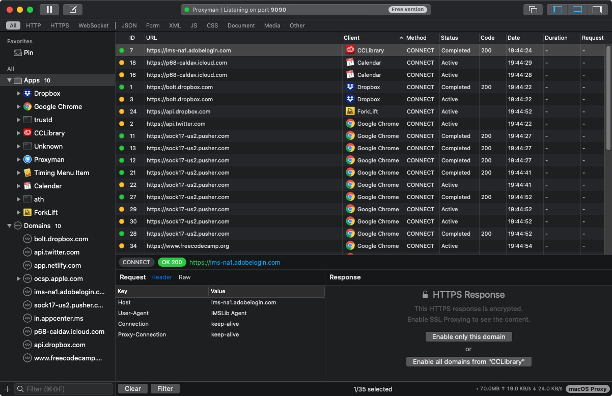

---


#### [Paw](https://paw.cloud/) - Beautiful HTTP client for Mac
![Backup Dropbox][backup-dropbox] ![Usage medium][usage-medium] ![Proprietary backup][backup-proprietary] [![Upvote on Product Hunt][product-hunt]](https://www.producthunt.com/posts/paw)

https://paw.cloud/extensions/

##### CLI installation
```sh
brew install --caskpaw
```


#### [TablePlus](https://tableplus.com/download) - The best GUI for relational databases
![Licence ~$50][licence-50] ![Usage high][usage-high]

<details>
  <summary>What for? - What I ❤️ - What I 👎</summary>

##### What for?

* To manage relational databases

##### What I ❤️

* The number of databases supported
* The clean UI interface
* Support for MongoDB (more coming soon)
* Support for Mac and Windows

##### What I 👎

* 0️⃣

</details>

##### CLI installation
```sh
brew install --casktableplus
```


#### [Postman](https://www.postman.com/downloads/) - A free alternative to Paw
![Free][licence-free] ![Usage medium][usage-medium] ![Proprietary backup][backup-proprietary]


#### [Mockoon](https://mockoon.com/) - Has never been so easy to create a mock server
![Free][licence-free] ![Usage medium][usage-medium] [![Upvote on Product Hunt][product-hunt]](https://www.producthunt.com/posts/mockoon)

##### CLI installation
```sh
brew install --caskmockoon
```


#### [Docker](https://www.docker.com/products/docker-desktop) - Containerize everything!
![Free][licence-free] ![Usage high][usage-high]

##### CLI installation
```sh
brew install docker

brew install --caskdocker-toolbox
```


#### [Altair GraphQL Client](https://altair.sirmuel.design/) - Beautiful GraphQL Client
![Free][licence-free] ![Usage low][usage-low] [![Show your support][support]](https://opencollective.com/altair/donate)

##### CLI installation
```sh
brew install --caskaltair-graphql-client
```


#### [Screaming Frog SEO Spider](https://www.screamingfrog.co.uk/seo-spider/) - Website crawler to test SEO issues
![Free][licence-free-limit] ![Usage low][usage-low]


#### [Poedit](https://poedit.net/download) - Translations made easy
![Free][licence-free-limit] ![Usage low][usage-low] [![Upvote on Product Hunt][product-hunt]](https://www.producthunt.com/posts/poedit-2)

##### CLI installation
```sh
brew install --caskpoedit
```

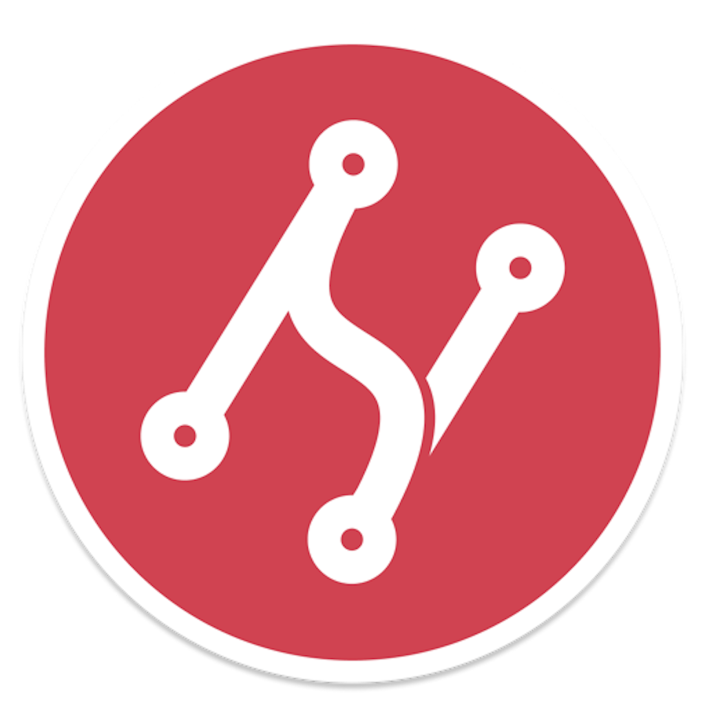

#### [SwitchHosts!](https://oldj.github.io/SwitchHosts/) - Hosts management & switching
![Free][licence-free] ![Usage low][usage-low] [![Upvote on Product Hunt][product-hunt]](https://www.producthunt.com/posts/switchhosts)

##### CLI installation
```sh
brew install --caskswitchhosts
```


#### [Core Shell](https://coreshell.app/) - Full featured terminal with OpenSSH support
![Free][licence-free-limit]  ![Usage low][usage-low]


#### [VirtualBox](https://www.virtualbox.org/) - In case I need to debug on Windows
![Free][licence-free] ![Usage low][usage-low]


#### [Smart JSON Editor](http://www.smartjsoneditor.com/) - JSON data manipulation for Mac
![Free][licence-free-limit] ![Licence ~$10][licence-10]

Free alternative [Jayson](https://jayson.app/)

##### CLI installation
```sh
mas install 1268962404
```


#### [Carbonize](https://www.dangercove.com/carbonize/) - Generate beautiful code snippets
![Free][licence-free] ![Usage low][usage-low] [![Upvote on Product Hunt][product-hunt]](https://www.producthunt.com/posts/carbonize)

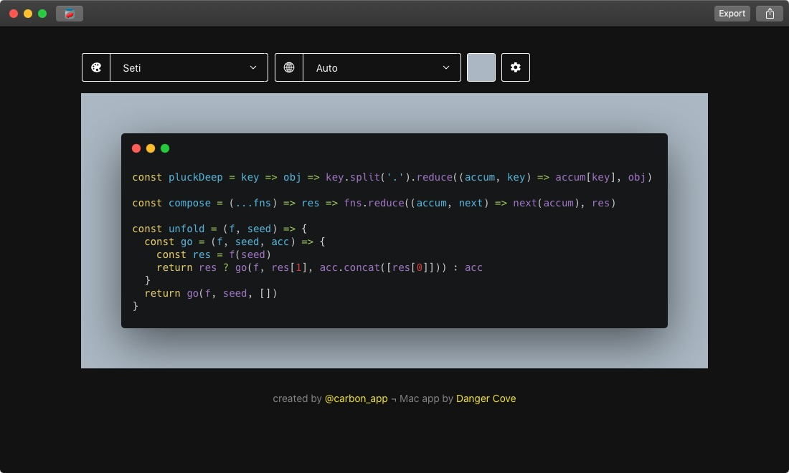

---


#### [CodeKit](https://codekitapp.com/) - Gulp, Grunt, Pug are on a boat
![Licence ~$34][licence-30] ![Usage low][usage-low] [![Upvote on Product Hunt][product-hunt]](https://www.producthunt.com/posts/codekit)

- CodeKit was one of the best and first software that would convert Sass to CSS. A lot of improvements were made since then. I use it when I'm lazy and don't want to configure Gulp, [ParcelJS](https://parceljs.org/) or Webpack.


#### [Haskell](http://haskellformac.com/) - Haskell for Mac IDE
![Licence ~$30][licence-30] ![Usage low][usage-low] [![Upvote on Product Hunt][product-hunt]](https://www.producthunt.com/posts/haskell-for-mac)

##### CLI installation
```sh
mas install Haskell
```

### Reading & Writing


#### [Reeder](https://reederapp.com/) - To stay informed
![Licence ~$13][licence-10] ![Usage high][usage-high] [![Upvote on Product Hunt][product-hunt]](https://www.producthunt.com/posts/reeder-3-2)

* I use [Feedly](https://feedly.com/) to store all my RSS feeds and synchronize with Reeder.
* I like to activate the *Bionic Reading* setting, which speed up my reading.
* **DEVONthink 3** and **Things** are activated in the "Actions and Sharing" settings.

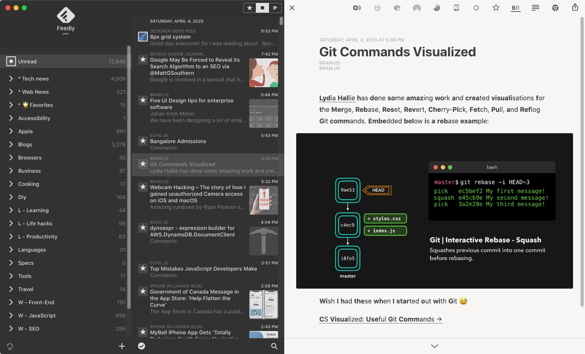

##### CLI installation
```sh
mas install 880001334
```


#### [Scapple](https://www.literatureandlatte.com/scapple/overview) - Brain, ideas and connections
![Licence ~$20][licence-20] ![Usage medium][usage-medium] ![Backup Dropbox][backup-dropbox] [![Upvote on Product Hunt][product-hunt]](https://www.producthunt.com/posts/scapple)

- When I want to brainstorm without any structure, Scapple is the first tool I use in my workflow.
- It allows me to put all words / ideas I can think of and then start establishing relationships.
- When I have a better vision or want to be more organize, I usually switch in using [MindNode](#mindnode---interactive-mind-mapping).

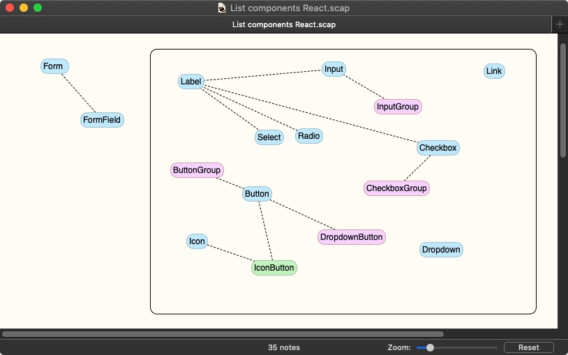

##### CLI installation
```sh
brew install --caskscapple

mas install 568020055
```


#### [MindNode](https://mindnode.com) - Interactive Mind Mapping
![Licence ~$30][licence-30] ![Backup iCloud][backup-icloud] ![High medium][usage-medium] [![Upvote on Product Hunt][product-hunt]](https://www.producthunt.com/posts/mindnode-5)

##### What for?

* To help organization thoughts and ideas

##### What I ❤️

* Easy to use
* Nice UI and integration with MacOS / iOS

##### What I 👎

* The mobile application cost
* No enough inovations

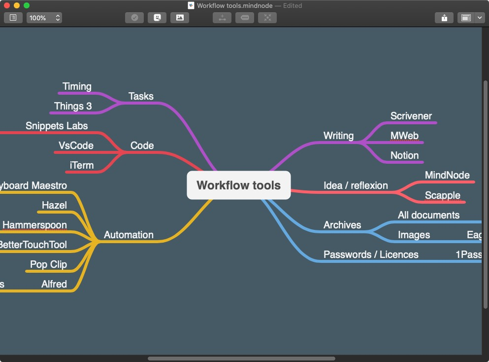

##### CLI installation
```sh
brew install --caskmindnode-pro

mas install 1289197285
```


#### [Notion](https://www.notion.so) - Notes, docs, knowledge base and more, in one place
![Yearly subscription][subscription-yearly] ![Proprietary backup][backup-proprietary] ![High usage][usage-high] [![Upvote on Product Hunt][product-hunt]](https://www.producthunt.com/posts/notion-2-0)

##### CLI installation
```sh
brew install --casknotion
```


#### [DEVONthink](https://www.devontechnologies.com/apps/devonthink) - To collect, organize and edit all my documents and articles
 ![Usage high][usage-high] ![Backup iCloud][backup-icloud]

* I used [Evernote](https://evernote.com/) for years, but the lack of new features I decided to use DEVONthink and have no regrets.

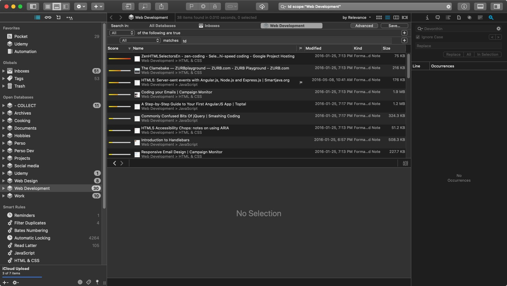

##### Extensions / plugins
* [Chrome extension](https://chrome.google.com/webstore/detail/clip-to-devonthink/pjoafdokmbmkpolhcnmnkgaicbajigcc?hl=en)
* [Alfred extension](https://www.packal.org/workflow/devonthink-search)
* [PopClip extension](https://pilotmoon.com/popclip/extensions/page/DEVONthink3)
* [Airmail services activation](https://help.airmailapp.com/en-us/article/integration-devonthink-1wd677j/)

##### CLI installation
```sh
brew install --caskdevonthink
```


#### [DEVONagent Pro](https://www.devontechnologies.com/apps/devonagent) - Search the web and filter the results
![Licence ~$50][licence-50] ![High medium][usage-medium]

* I use DEVONagent Pro every-time I need to do research to prepare a presentation, write an article or produce some sort of content.

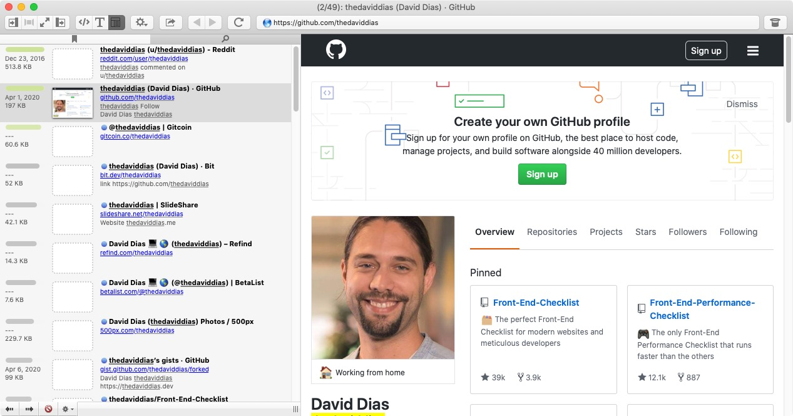

---


#### [MWeb](https://www.mweb.im/) - A powerful Markdown Editor
![Licence ~$20][licence-20] ![Backup iCloud][backup-icloud] ![Usage high][usage-high] [![Upvote on Product Hunt][product-hunt]](https://www.producthunt.com/posts/mweb)

- I've used [Marked 2](https://marked2app.com/), [Ulysses](https://ulysses.app/) and [Boostnode](https://boostnote.io/) but MWeb is the one app I've enjoy the most using.

<details>
  <summary>What for? - What I ❤️ - What I 👎</summary>

##### What for?

* Markdown Editor

##### What I ❤️

* The dual panel with Markdown in one side and the preview in the other
* Beautiful themes

##### What I 👎

* No recent updates
* The scroll for the Editor and preview panel is usually not synchronized 
* No possibility to deactivate the synchronized scroll

</details>

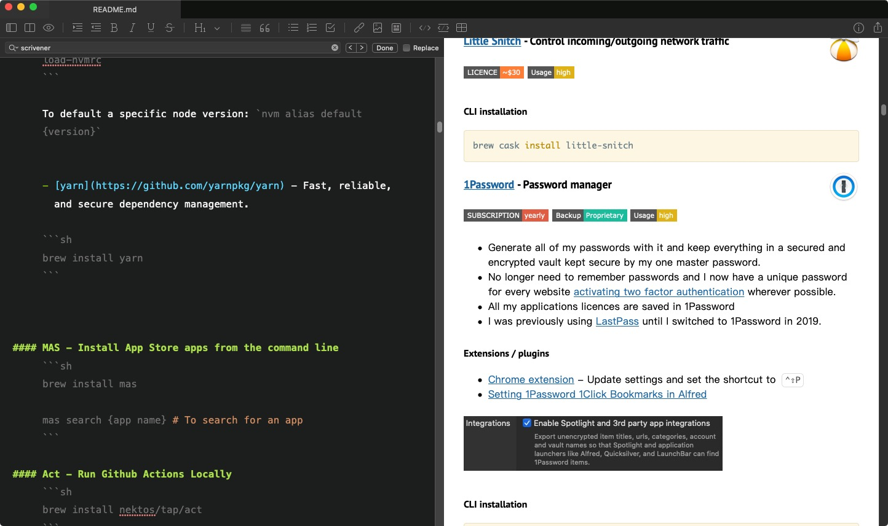

##### Possible alternatives
* [Mou](http://25.io/mou/)
* [MacDown](https://macdown.uranusjr.com/)
* [Quiver](http://happenapps.com/#quiver)

##### CLI installation
```sh
mas install 1403919533
```


#### [Scrivener](https://www.literatureandlatte.com/scrivener/overview) - One day I want to be a writer
![Licence ~$50][licence-50] ![Usage low][usage-low] ![Backup Dropbox][backup-dropbox] [![Upvote on Product Hunt][product-hunt]](https://www.producthunt.com/posts/scrivener-3-0)

- Scrivener is the perfect tool to write any book.
- I've used Scrivener in the past to work on the outline for a video course.
- I'm planning in using it more and maybe start writing small non-fictional ebooks soon.

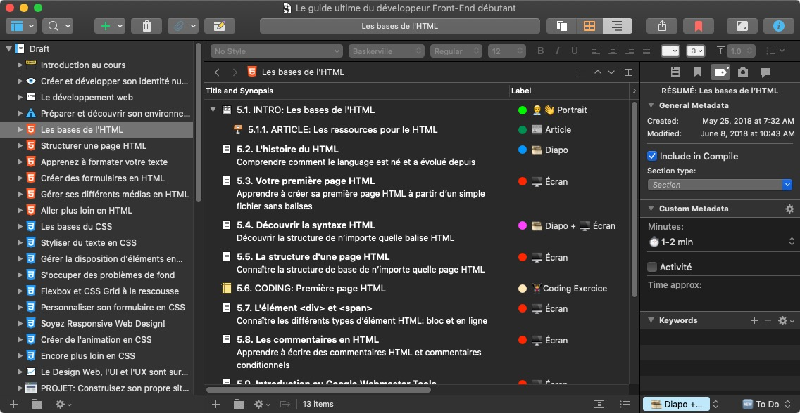

##### CLI installation
```sh
brew install --caskscrivener

mas install 1310686187
```


#### [Apple Keynote](https://www.apple.com/keynote/) - A better alternative to Powerpoint
![Free][licence-free] ![Backup iCloud][backup-icloud] [![Upvote on Product Hunt][product-hunt]](https://www.producthunt.com/posts/keynote-10-0)

### Communication


#### [Slack](https://slack.com) - Work chat and more
![Free][licence-free] ![Usage high][usage-high] ![Proprietary backup][backup-proprietary] [![Upvote on Product Hunt][product-hunt]](https://www.producthunt.com/posts/slack-for-mac)

##### Workspaces
- Dias testing (my own Slack workspace to test apps and webhooks)
- [Contentful Community](https://www.contentful.com/slack/)
- [A11y](https://web-a11y.slack.com/#/)
- [TorontoJS](http://slack.torontojs.com/)
- [FEDs](http://fedsonslack.com/)
- [Civic Tech Toronto](http://civictechto-slack-invite.herokuapp.com/)

```sh
brew install cask slack

mas install 803453959
```


#### [Airmail](https://airmailapp.com/) - My favorite email client
![Free][licence-free-limit] ![Yearly subscription][subscription-yearly] ![Backup iCloud][backup-icloud] ![Usage high][usage-high] [![Upvote on Product Hunt][product-hunt]](https://www.producthunt.com/posts/airmail-3-3)

* I've been using Airmail since I fully work on MacOS.
* I tried [Spark](https://sparkmailapp.com/) for few days but I didn't feel it was a big win in comparison to Airmail.
* Like many people, I approach my emails tasks in GTD style, trying to always be close to zero emails in my inbox.

##### Filters and triage

I used "filters" on Gmail to organize most of my emails (especially newsletters, bills, recurring emails...). I wish Gmail would have an easiest way to create these filters.
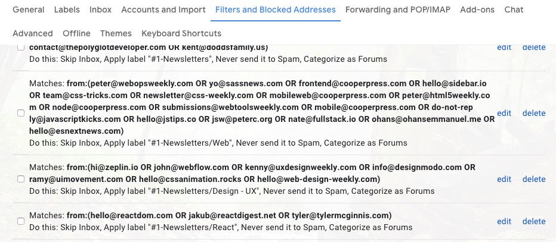

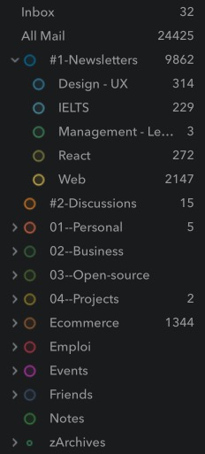

##### CLI installation
```sh
brew install --caskairmail

mas install 918858936
```

### Social Media

I have a strict rule in regards to social apps on my professional Mac. I usually don't have any social / communication app that is not directly related to work (only Slack). These apps are mostly on my personal MacBook.


#### [Signal](https://signal.org/download/) - Signal on Mac
![Free][licence-free] ![Usage low][usage-low]

#### [Messenger](https://apps.apple.com/us/app/messenger/id1480068668?mt=12) - Facebook Messenger but on Mac
![Free][licence-free] ![Usage low][usage-low] [![Upvote on Product Hunt][product-hunt]](https://www.producthunt.com/posts/messenger-for-mac-2)


#### [WhatsApp](https://www.whatsapp.com/download) - WhatsApp on Mac
![Free][licence-free] ![Usage low][usage-low] [![Upvote on Product Hunt][product-hunt]](https://www.producthunt.com/posts/whatsapp-desktop-2)


#### [Discord](https://discordapp.com/download) - Popular chat platform amount developers and companies
![Free][licence-free] ![Usage low][usage-low]

I use mostly Discord to talk with HTMLHint contributors and other platforms.


#### [Skype](https://www.skype.com/en/get-skype/)
![Free][licence-free] ![Usage low][usage-low] [![Upvote on Product Hunt][product-hunt]](https://www.producthunt.com/posts/skype)

* Skype was my to-go chat app for years, but since Google Meet, Facebook Messenger and WhatsApp, I only use with 2-3 people that are not on these platforms.

##### CLI installation
```sh
brew install --caskskype
```

### Design & Web Design

I'm not a Web Designer / Designer, but I love studying Photography, UI and UX. I try to practice as much as I can using the following applications.


#### [Eagle](https://en.eagle.cool/) - Organize my design library
![Yearly subscription][subscription-yearly] ![Usage high][usage-high] ![Backup Dropbox][backup-dropbox] [![Upvote on Product Hunt][product-hunt]](https://www.producthunt.com/posts/eagle-5)

<details>
  <summary>What for? - What I ❤️ - What I 👎</summary>

##### What for?

* To manage all my media files (images, PSD, sketch files...)

##### What I ❤️

* Backup on Dropbox
* Recent updates
* Chrome extension which save any image with a simple drag and drop
* Fast
* Lot of options

##### What I 👎

* 0️⃣

</details>

##### Extensions / plugins
* [Eagle Chrome extension](https://chrome.google.com/webstore/detail/eagle-save-images-faster/lieogkinebikhdchceieedcigeafdkid?hl=en)


#### [Rightfont 5](https://rightfontapp.com/) - The best font manager for Mac
![Licence ~$35][licence-30] ![Usage medium][usage-medium] ![Backup Dropbox][backup-dropbox] [![Upvote on Product Hunt][product-hunt]](https://www.producthunt.com/posts/rightfont-3)

- By far, the best font manager that supports my library of more than 80 000 font files.

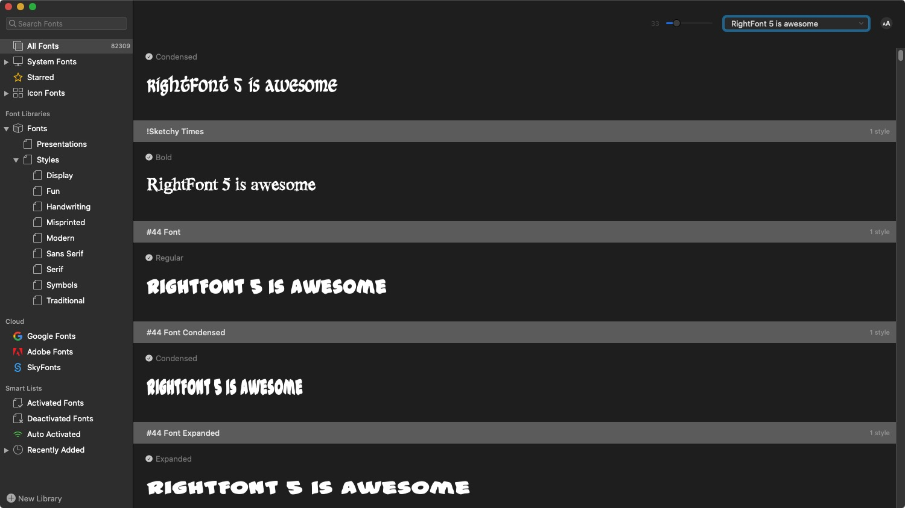


#### [IconJar](https://geticonjar.com/) - Best icon manager
![Yearly subscription][subscription-yearly] ![Usage low][usage-low] ![Backup Dropbox][backup-dropbox] [![Upvote on Product Hunt][product-hunt]](https://www.producthunt.com/posts/iconjar-27d1357a-d286-4c95-9c4d-ce1558dc8113)

* All my icons are stored on IconJar
* I could also used [Eagle](#eagle---organize-my-design-library) to store these, but I prefer to have a dedicated software to manage all icon's formats.

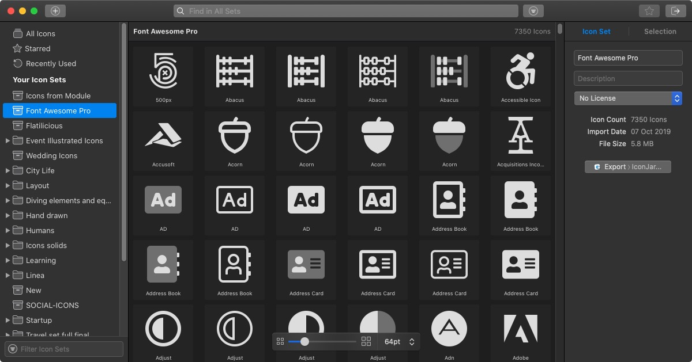

---

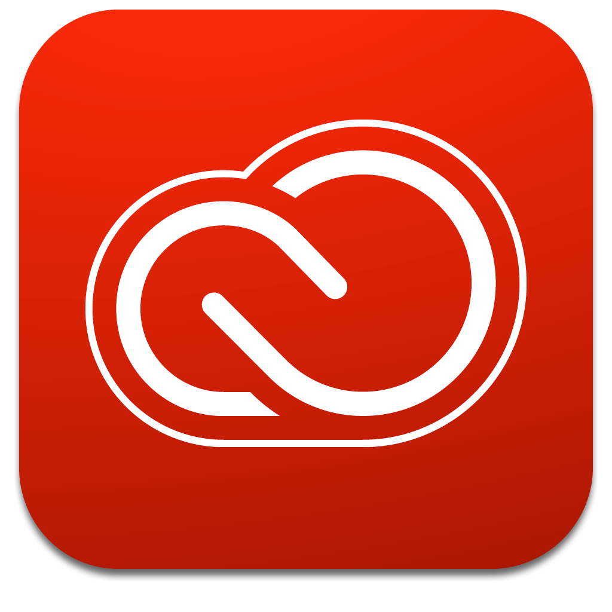

#### [Adobe Creative Cloud](https://www.adobe.com/ca/creativecloud.html)
![Monthly subscription][subscription-montly] ![Proprietary backup][backup-proprietary] ![Usage high][usage-high]

- List of Adobe Softwares I most often use
    - Adobe Photoshop
    - Adobe Illustrator
    - Adobe Premiere Rush
    - Adobe Premiere Pro
    - Adobe Audition
    - Adobe Lightroom Classic
    - Adobe Acrobat
    - ...

##### CLI installation
```sh
brew install --caskadobe-creative-cloud
```


#### [Figma](https://www.figma.com/)
![Free][licence-free-limit] ![Usage low][usage-low] ![Usage medium][usage-medium] ![Proprietary backup][backup-proprietary] [![Upvote on Product Hunt][product-hunt]](https://www.producthunt.com/posts/figma-3-0)

I'm planning in using more Figma as I don't want to renew Sketch in regards to my real usage.

##### CLI installation
```sh
brew install --caskfigma
```


#### [Sketch](https://www.sketch.com/)
![Yearly subscription][subscription-yearly] ![Usage medium][usage-medium] ![Backup Dropbox][backup-dropbox] [![Upvote on Product Hunt][product-hunt]](https://www.producthunt.com/posts/sketch-52)

Still a reference (vs Adobe XD and Figma) but I didn't renew my licence in 2019. Planning in using Figma instead when needed.

##### CLI installation
```sh
brew install --casksketch
```

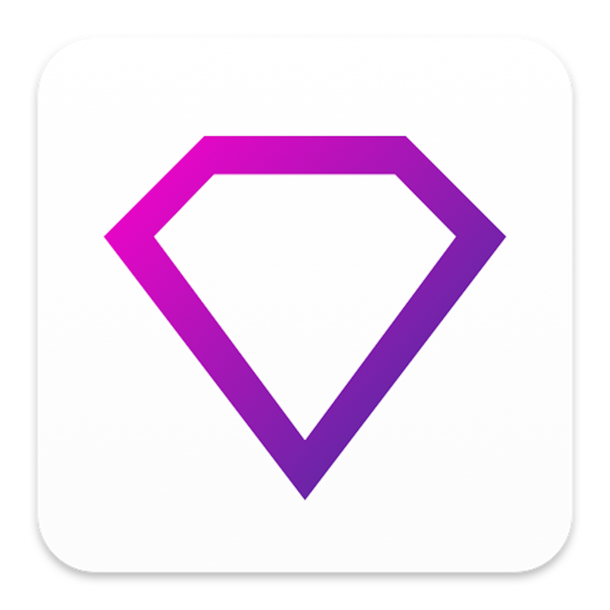

#### [Sketchpacks](https://sketchpacks.com/)
![Free][licence-free] ![Usage low][usage-low]

To manage plugins for Sketch

#### [Zeplin](https://zeplin.io/)
![Usage medium][usage-medium] ![Proprietary backup][backup-proprietary] [![Upvote on Product Hunt][product-hunt]](https://www.producthunt.com/posts/zeplin-3-0)

Used Zeplin mostly at work. I remember when it first came out. A lot of updates and improvements since.

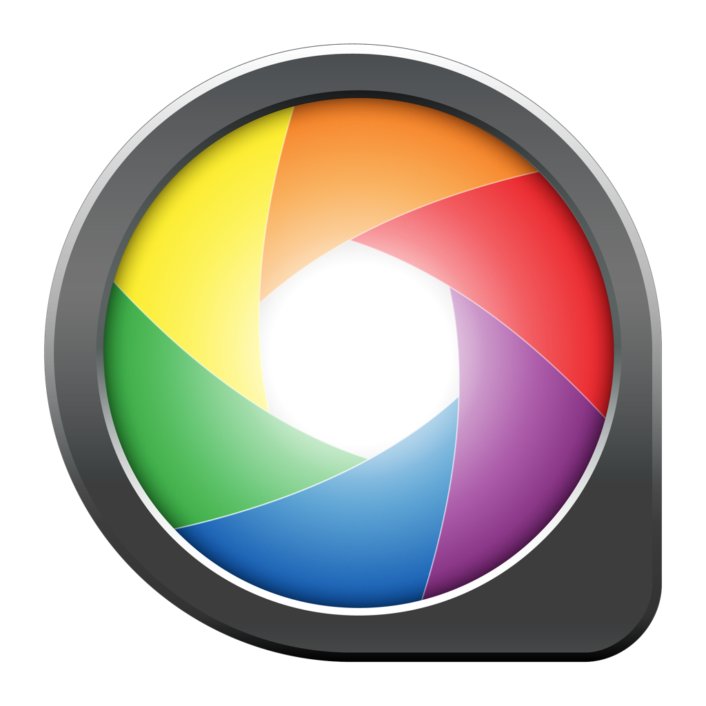

#### [ColorSnapper2](https://colorsnapper.com/) - Collect, organize and share colors
![Licence ~$20][licence-20] ![Usage medium][usage-medium]

My go-to color-picker.

##### CLI installation
```sh
brew install --caskcolorsnapper
```


##### Alternatives

- I've used [Sip](https://sipapp.io/) in the past but recently switched to ColorSnapper2 because no subscription.

##### CLI installation
```sh
brew install --casksip
```


#### [ImageOptim](https://imageoptim.com/mac) - Optimize images
![Free][licence-free] ![Usage low][usage-low] [![Upvote on Product Hunt][product-hunt]](https://www.producthunt.com/posts/imageoptim)

##### CLI installation
```sh
brew install --caskimageoptim
```

### Audio & Video production


#### [VLC](https://www.videolan.org/vlc/index.html) - A Media player built by my compatriots
![Free][licence-free] ![Usage high][usage-high] [![Show your support][support]](https://www.videolan.org/contribute.html#money)

It's not because it was build by French people that I love this app!


#### [Loopback](https://rogueamoeba.com/loopback/) - Cable-free audio routing for Mac
 ![Licence ~$100][licence-100] ![Usage low][usage-low]

<details>
  <summary>What for? - What I ❤️ - What I 👎</summary>

##### What for?

* When you want to combine different audio sources, essential if you do podcasts

##### What I ❤️

* Easy to use
* Works perfectly

##### What I 👎

* Price

</details>


#### [Audio Hijack](https://rogueamoeba.com/audiohijack/) - Record any audio
 ![Licence ~$50][licence-50] ![Usage low][usage-low]

<details>
  <summary>What for? - What I ❤️ - What I 👎</summary>

##### What for?

* Record any source audio, I use to record podcasts

##### What I ❤️

* With Loopback, Audio Hijack transforms your Mac in a real studio
* Build-in effects (like Dehum and band EQ)

##### What I 👎

* 0️⃣

</details>


#### [Ecamm Live](https://www.ecamm.com/mac/ecammlive/) - The simplest tool for doing live streaming on Facebook / Youtube
 ![Free][licence-free] ![Usage medium][usage-medium]


#### [Streamlabs OBS](https://streamlabs.com/) - The best (and free)  streaming app
![Free][licence-free] ![Usage medium][usage-medium]

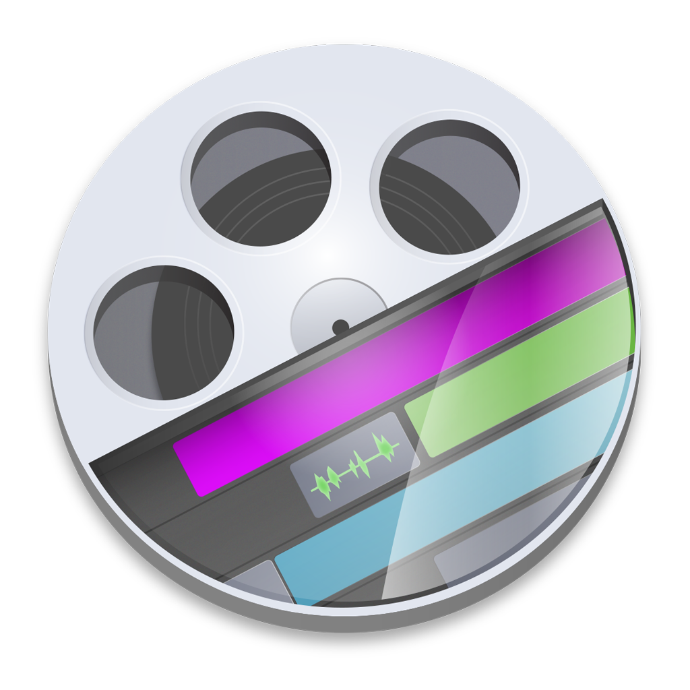

#### [Screenflow 9](https://www.telestream.net/controls/screenflow/download-screenflow.htm) - Screen recording and editing like a pro
![Licence ~$100][licence-100] ![Usage low][usage-low] ![Backup Dropbox][backup-dropbox] [![Upvote on Product Hunt][product-hunt]](https://www.producthunt.com/posts/screenflow-9)

- Screenflow doesn't recommend to store files on Dropbox, so I usually store the files on Dropbox but move them to my local hard drive if I want to edit these. No problem until today.

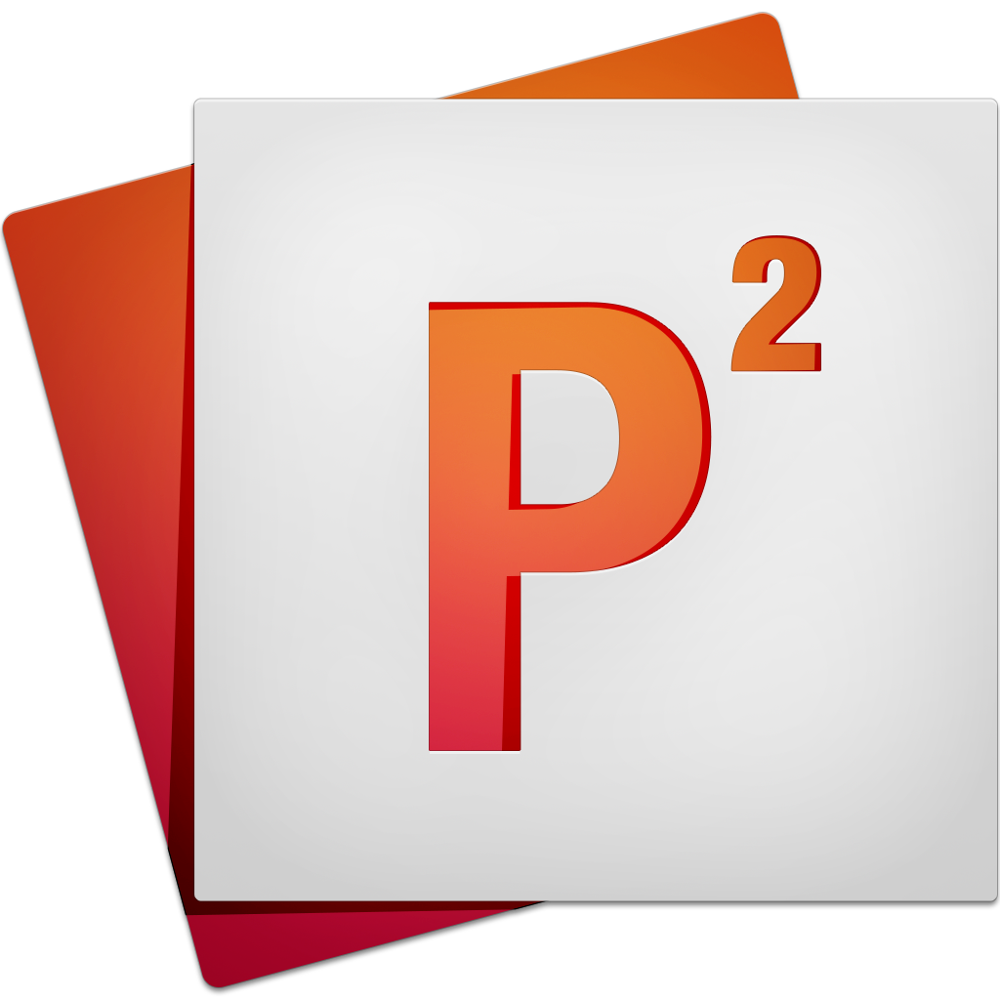

#### [Power Prompter](https://suborbital.io/powerprompter/download/) -
![Licence ~$50][licence-50] ![Usage low][usage-low]


#### [Twitch](https://www.twitch.tv/) - The well-known streaming platform
![Free][licence-free] ![Usage medium][usage-medium]


### Miscellaneous


#### [KeyKey](http://keykey.ninja/) - A minimalist touch typing tutor for Mac
![Licence ~$20][licence-20] ![Usage low][usage-low] [![Upvote on Product Hunt][product-hunt]](https://www.producthunt.com/posts/keykey-typing-tutor-for-mac)


#### [Type Fu](https://type-fu.com/) - Typing training
![Free][licence-free] ![Usage medium][usage-medium]

The only typing program that has a "Code" practice section


#### [Typesy](https://www.typesy.com/) - When I want to compete with my wife
![Licence ~$30][licence-30] ![Usage low][usage-low]


#### [GPG Suite](https://gpgtools.org/) - Encrypt, decrypt, sign and verify files or messages.
![Free][licence-free] ![Usage high][usage-high]

- I use this also for signing my commits.

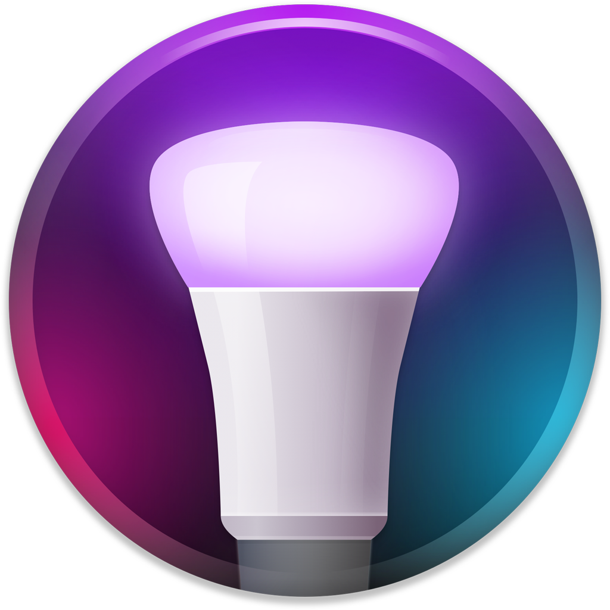

#### [Hue Sync](https://www2.meethue.com/en-au/entertainment/hue-sync) - Sync my lights with audio / video files
![Free][licence-free] ![Usage low][usage-low]

##### CLI installation

```sh
brew install --cask
```

## Mac preferences

### Dock

#### Add spaces to my dock

```sh
defaults write com.apple.dock persistent-apps -array-add '{"tile-type"="spacer-tile";}'; killall Dock
```

- Dock screenshot


## Web Applications

* Invision
* [Namecheap](https://www.namecheap.com/) - The best domain registrar
* [StatusCake](https://www.statuscake.com/) - To keep an eye on your website uptime
* [Themer.dev](https://themer.dev/) - To generate themes (editors, terminals, wallpapers, and more) with ease
* [Netlify](https://netlify.com/)
* [codeimg](https://codeimg.io/) - To easily create social media banners
* [Gradient Magic](https://www.gradientmagic.com/) - Free gallery of CSS Gradients


## Inspiration

Heavily inspired by the works from:

- https://github.com/nikitavoloboev/my-mac-os
- https://github.com/donnemartin/dev-setup

## Icons and images

All logos and brand/applications names are registered and below to their owners.

<div>Icons made by <a href="https://www.flaticon.com/authors/pixel-perfect" title="Pixel perfect">Pixel perfect</a> from <a href="https://www.flaticon.com/" title="Flaticon">www.flaticon.com</a></div>

<div>Icons made by <a href="https://www.flaticon.com/authors/flat-icons" title="Flat Icons">Flat Icons</a> from <a href="https://www.flaticon.com/" title="Flaticon">www.flaticon.com</a></div>

<div>Icons made by <a href="https://www.flaticon.com/authors/prettycons" title="prettycons">prettycons</a> from <a href="https://www.flaticon.com/" title="Flaticon">www.flaticon.com</a></div>

## Licence

MIT

[licence-free]: https://img.shields.io/static/v1?style=flat-square&label=LICENCE&message=FREE&color=green
[licence-free-limit]: https://img.shields.io/static/v1?style=flat-square&label=LICENCE&message=FREE%20with%20limits&color=green
[licence-10]: https://img.shields.io/static/v1?style=flat-square&label=LICENCE&message=~$10&color=orange
[licence-20]: https://img.shields.io/static/v1?style=flat-square&label=LICENCE&message=~$20&color=orange
[licence-30]: https://img.shields.io/static/v1?style=flat-square&label=LICENCE&message=~$30&color=orange
[licence-50]: https://img.shields.io/static/v1?style=flat-square&label=LICENCE&message=~$50&color=orange
[licence-100]: https://img.shields.io/static/v1?style=flat-square&label=LICENCE&message=~$100&color=orange

[subscription-montly]: https://img.shields.io/static/v1?style=flat-square&label=SUBSCRIPTION&message=montly&color=red
[subscription-yearly]: https://img.shields.io/static/v1?style=flat-square&label=SUBSCRIPTION&message=yearly&color=red

[backup-icloud]: https://img.shields.io/static/v1?style=flat-square&label=Backup&message=iCloud&color=1abc9c
[backup-dropbox]: https://img.shields.io/static/v1?style=flat-square&label=Backup&message=Dropbox&color=1abc9c
[backup-github]: https://img.shields.io/static/v1?style=flat-square&label=Backup&message=Github&color=1abc9c
[backup-proprietary]: https://img.shields.io/static/v1?style=flat-square&label=Backup&message=Proprietary&color=1abc9c

[since-2016]: https://img.shields.io/static/v1?style=flat-square&label=Using%20since&message=2016&color=1f425f
[since-2017]: https://img.shields.io/static/v1?style=flat-square&label=Using%20since&message=2017&color=1f425f
[since-2018]: https://img.shields.io/static/v1?style=flat-square&label=Using%20since&message=2018&color=1f425f
[since-2019]: https://img.shields.io/static/v1?style=flat-square&label=Using%20since&message=2019&color=1f425f

[usage-high]: https://img.shields.io/static/v1?style=flat-square&label=Usage&message=high&color=yellow
[usage-medium]: https://img.shields.io/static/v1?style=flat-square&label=Usage&message=medium&color=yellow
[usage-low]: https://img.shields.io/static/v1?style=flat-square&label=Usage&message=low&color=yellow

[support]: https://img.shields.io/static/v1?style=flat-square&label=Support&message=this%20app&color=purple
[product-hunt]: https://img.shields.io/static/v1?style=flat-square&label=Product%20Hunt&message=👍&color=da552f
